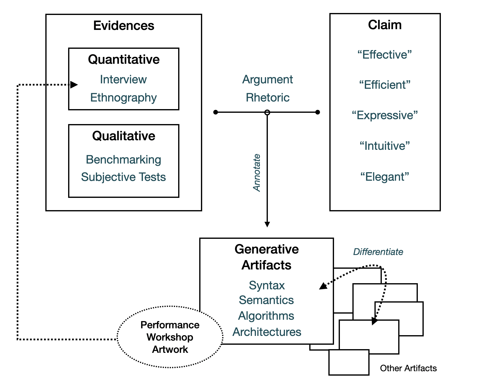

<!-- どうコンピュータ音楽プログラミング言語を研究するか -->

# 音楽プログラミング言語をどう研究するか

本章ではまず、音楽プログラミング言語を設計するという行為は学術的にはどのように正当化できるだろうか、という問いについて検討する。

新しい音楽プログラミング言語や、コンピューターを用いた音楽の表現を科学的な研究として提示するには直感的には2つのアプローチがあるように見える。

1つは、これまでできたことをさらに効率よくできるようになったと主張すること、もう1つは、これまでできなかった表現ができるようになったと主張することだ。合わせ技として、例えば人間にはできないレベルの複雑さのアルゴリズミックコンポジションをコンピューターの計算能力を借りることによって実現できるようにする、効率により新しい表現にアプローチするというものも考えられる。

さてこの時、できなかったことをできるようにしたタイプの研究の場合、新しくできるようになったことの何がよいのかに関しての正当化を求めるべきか、仮にそうだとしたらどのようにすればいいのかという問題がある。研究者とその音楽の表現を必要としている者（≒ユーザー）が分かれている場合にはどんなにニッチな表現であっても表現の多様性を押し広げるものとして正当化でき、一方で研究者自身が表現の当事者でもある時には、その表現ができたからどうした？といった構造があるように見える・・・。（もうちょっと整理したい）

こうした、音楽のためのソフトウェア制作を研究とする場合の位置づけとして、**デザイン実践を通じた研究（Research through Design:RtD）**と呼ばれるアプローチが考えられる。RtDとは簡単には、デザインという行為や対象が、単なるプロダクトからソフトウェア、インターフェース、サービスなど多様化する中、それを学術研究として捉えた時には、単に問題解決、仮説検証を行う科学とは異なる分野の学問として考える必要があるのではないかといった問題意識の中行われている様々な議論を、"不明瞭かつ個別固有の社会・技術的問題を対象とする臨床的、生成的研究"[@Mizuno2017]として位置付けるような運動である。

もっとも、RtD音楽のためのソフトウェア研究や新しい音表現のためのインターフェース（New Interfaces for Expression:NIME）研究においては、それらを包括するHuman-Computer Interaction(HCI)の分野において、単に仮説を検証し量的な評価を行うのでは正当化することができないような研究をどう評価していくべきかといった意味でのディスカッションとしても扱われている言葉ではある。本章ではまずデザイン学全体におけるRtDの議論の変遷を水野大二郎の文献[@Mizuno2014;@Mizuno2017]を中心に参照しつつ、音楽プログラミング言語、NIME研究の中でRtD的研究についての位置付けを行った論文との議論を並列することで、音楽プログラミング言語研究において、これまでより広範な意味でのRtD、特に、長い時間をかけて社会構造の変革を促すことを目指すトランジション・デザインのようなアプローチの研究の可能性を議論する。

# RtDの変遷 

HCI研究の中でのRtDというアプローチの位置付けについて検討したウィリアム・ゲイバーの「What Should We Expect from Research through Design?」(デザインを通じた研究に何を期待するべきか？)という論文では、RtDには、カール・ポパーの言う科学的アプローチたる必須条件、反証可能性（Falsifiability）がないことにより、RtDを科学から明確に区別する[@Gaver2012]。デザインが今日対象とする問題はリッテルとウェバーが60年代に導入し、90年代にブキャナンがデザインの理論の中に位置付けた "意地悪な問題(Wicked Problem)"[@Buchanan1992]—全ての問題やその解決のための試行が個別に異なりその試みを実証主義的な方法で理論として一般化することができないような問題だからである。

ゲイバーはその上でデザイン学における理論とは、作られた人工物に対する注釈(annotation)付きのポートフォリオのようなものだという提案をする。建築家クリストファー・アレクサンダーが提示し、2000年代にコンピュータープログラムやインターフェースのデザインのための指標となったパターンランゲージ[@Eto2009]のような、繰り返される試行から帰納的に得られる規則ではなく、個々の事例の個別性を保ったままに、自らが新しく作ったものの類似点や差異を見ることで、各事例の究極的個別性(Ultimate Particular)を保ちながらも、拡張可能かつ検証可能(Verifiable)な理論を構築できるというのだ。それゆえ、 "デザインの知識は生み出した人工物に近づき留まった時最も信頼に足る"[@Gaver2014,筆者訳]であるとする。

確かに、世界の中から未知の事実を発見する科学という行為と、世界の中に未知の事物を作り出しそれを解釈したりするデザインという行為はこの見方では全く別の体系に基づく学問ということとなる。しかし、この議論に乗るのだとすれば、筆者がこれから行おうと思っている音楽プログラミング言語の特徴や評価の語彙を整理したりする一般化や抽象化は無粋なものとなってしまうように思える。そこで、ここからはRtDの歴史的流れを継続してみていきながらも、一般論だけでなく音楽プログラミング言語という分野特有の事情を考慮しても同じ結論が出るかを考え、より本研究の位置付けを詳細に検討しよう。

# 音楽ソフトウェア・インターフェース研究におけるRtD

ダールは音楽のための新しいインターフェース：NIME研究は学術研究としてどのように位置づけられるかを、特にデザイン学を中心に検討した論考の中で、いくつかの指摘と問題提起を行う[@Dahl2015]。まず、新しい楽器を作ることは意地悪な問題の一類型であるということだ。もちろん、楽器の研究という領域が、例えば環境問題のように複数の関係者が相反した利害関係にあるような大規模な問題と全く同じような類の意地悪さではないのは確かだが、最低でも明確な議論のガイドラインが存在しないということや、一般化できる事例が少な過ぎて理論化しづらいという意味では、明確に科学的事実を明らかにする研究パラダイムとは異なるということは直感的に受け入れられる。

加えて、ダールはストークスの研究という行為を基礎的理解(≒知の創出)のための研究であるか？という軸、実用されることを考慮されているか？という軸の2つで分割した "パスツールの象限"[@Stokes1997]を参照しNIME研究の位置付けを試みる。[@fig:stoke]において、知の創出かつ実用を目的としない左上の領域は例えば量子力学におけるボーアのような基礎研究の領域であり、一方実用されることだけを目的とし知の創出そのものは目的としない右下のエジソンの発明群、そして、右上に実用的な理由に牽引されつつも新しい知の基礎となったパスツールの乳酸発酵の研究などがある。

![ストークスによる研究の象限。[@Dahl2015]より。](img/stokequad.png){#fig:stoke width=50%}

この象限にNIME研究を位置付けるとすればどこになるだろうか？右下の実用だけを意識したものだとすれば、それは企業が生産する楽器群とどのように区別ができるのだろうかという問題がある。実際にダールは、フォールマンによるデザインリサーチの3つ組という分類[@Fallman2003]を参照し、パスツールの象限における右下の領域と対応する、"産業とのインターフェース"であるDesign ProcessというカテゴリはNIME研究において企業が一般的に楽器を作るプロセスと対応するという。

一方右上の実用を通じて知の創出を得る研究なのだとすれば、1.その知とは一体なんなのか、2.その知をいかに証明できるか、3.その知は一体いつ発生するのかといった問題群が浮かび上がってくる。仮にNIMEで創出できる知もゲイバーがいうようなAnnotated Portfolioのように、理論として一般化することができず、個々の差異との比較によって議論されるものだとしたらいったん1.(What)と2.(How)は横に置いておいてもよいだろう。しかし3.(When)は筆者のようなソフトウェアを研究するものにとっては考えるべき重要な問題になる。つまり、NIME研究をするという時に、楽器を作る過程で得られる知見と、その楽器を演奏するとき、あるいは評価実験などでユーザーに使ってもらうことで得られる知見とが混在していることをダールは指摘しているのだ。

音楽プログラミング言語全般の開発を研究とする場合にも、NIME研究における学術的研究の位置付けとは何かという疑問を同様に適用することができる。西野は音楽プログラミング言語設計という行為が、音声合成の手法の確立などの研究と比べれば、実用的なツールとしての目的意識と評価という側面が強く、知への貢献という側面が十分に取り上げられていないということを指摘し、自らが開発するLC言語の設計をRtDの側面から分析している。西野はmicrosoundという、ローズによって提案された、音声データを数ミリ秒単位に切り刻み再構成するような音声合成の手法[@Roads2003]が既存の言語では十分に表現できないという具体的事象から、mostly-strongly-timed languageという新しい音楽プログラミング言語における概念の創出ができているという具体例を示す[@Nishino2012]。これはストークスの四象限におけるパスツールに相当するものと言える。もっとも、mostly-strongly-timedというコンセプト自体を引き継いだ言語はLC以後開発されているわけではなく、果たして創出された知や概念というものがパスツールの発見した乳酸菌と同じように扱えるのだろうか、デザインを通じて作られた、究極的に個別的な人工物と区別がつくのだろうかという疑問は残る。とはいえ、第4章で詳しく見るように、mostly-strongly-timedコンセプトの元となったChucK言語のstrongly-timedという、論理時間スケジューラ上でのサンプル単位での正確な制御を可能にする概念は明確に他の言語にも影響を与えている他、直接的にChucKの思想を受け継ぎ記法の自由度を高めたGwion言語のように、設計思想や言語仕様の歴史的系統は音楽プログラミング言語にある程度存在してはいる。

# プログラミング言語における量と質の相互作用

こうしたデザインの個別性に伴う理論の一般化や評価の困難さは本論文で検討するもう1つの領域、プログラミング言語一般に関する評価について検討することでもう少し明確な議論をすることができる。

音楽目的に限らない、システムレベルのソフトウェア開発などに使われるプログラミング言語の設計を考えれば、その言語によって作られるアプリケーションの実行速度は明らかに重要な評価指標であり、また（使われるマシンの種類などの環境を揃えれば）定量的に計測することが可能である。では、あるプログラミング言語のコンパイラの機能Xの実装を工夫することにより、実行速度を20%ほど改善できたとしたら、それはなんらかの事実を解明したことになるのだろうか、それともある手法やソフトウェアといった人工物を生成したことになるのだろうか？といったように、プログラミング言語という分野自体、1960年頃から工学的なアプローチで長く研究がされている中、学術的研究としてどう正当化するか、特にどのように評価すればよいかという話題は2009年のACM SIGPLAN（Special Interest Group of Programming Language:プログラミング言語の国際会議を主催する団体で最も大きなもの）主催の*PLATEAU: Evaluation and Usability of Programming Languages and Tools*が開催されるまであまり触れられてこなかった。

2010年のPLATEAUでマークストラムは新しい言語の実装や設計などのアイデアを論文として提示する際の正当化の方法として、**主張と根拠の整合性(Claim-Evidence-Correspondense)**という見方を提示する[@Markstrum2010]。マークストラムによれば、プログラミング言語の論文で提示される主張は大きく分けて3種類あるという。1つ目はこれまで存在しなかった新機能を作ったというもの、2つ目はすでにある既存の機能の効率性を上げるような内容、3つ目は望ましい言語の特徴(property)、つまりこの言語は直感的である、読みやすい、効率的であるといったような内容だ。しかしこれまでのプログラミング言語の提案の論文には、1と2、つまり新機能と機能の増強に関しては論文が査読されたものであるならば十分認められるものであるが、望ましい言語の特徴に関してはその主張と、それを支える根拠は両方とも提示されているが論理的な結びつきは不十分なものが多数あるとしたのだ。

こうした研究はのちにより近年のコブレンツらによるプログラミング言語における評価語彙の整理（第5章で詳しく紹介する）などにつながる。主張と根拠の整合性を証明する方法論は統計的な評価実験のような実証主義的方法だけでは不十分とマークストラム自身も警鐘しており、例えば近年のミュラーとリングラーの修辞的フレームワークのように、論文中で主張された表現の変遷などを人文学的手法で辿ることで明らかにするような研究が進んでいる[@Muller2020]。

つまりプログラミング言語という領域における知の創出の体系は、新しい文法の提示のような生成的な人工物、ベンチマークテストのような量的に計測、比較ができる結果、ユーザーインタビュー調査のような質的調査の結果、主観評価実験のような統計的手法による量的なユーザーフィードバックといった様々な種類の論拠を組み合わせて、効率が良い、読みやすい、表現力が高いと言った主張をなんらかの修辞的な方法によって結びつけることによって行われる。

このようにプログラミング言語という領域が、論拠に関してはある程度反証可能性が存在する、しかし最終的に作られた言語そのものの定量、定質的評価が難しいという形而上学とも形而下学(≒科学)とも言える独特の体系を持つ理由としては、量的な特徴の変化がその言語の質的な変化に大きく影響を与えることが時にあるという事情も挙げられる。

例えば音楽プログラミング言語に関していえば、本章冒頭で"合わせ技"と表現したように、アルゴリズムを用いた作曲を同じ手法でも、人間が手動では行えないような計算速度を借りることによって異なる種類の音楽にすることができるし、第4章で見るように、音楽プログラミング初期の一度信号処理の結果をテープに書き込んでから再生する方式と、80年代以降のリアルタイムに信号処理ができる環境とでは作られる音楽の質も大きく異なる。一見単純な実行速度という量的な指標はある段階から質的な問題へと転化するのだ。加えて、より事情を複雑にする問題としては、例えばライブコーディングのような、プログラムの動的変更のしやすさという質的特徴を強化した言語を作ろうと思うと、プログラムの実行性能は静的な言語と比べると低くならざるを得ないという、いわば**量的特徴と質的特徴間のトレードオフ**が発生するという問題がある。

こうした事情を鑑みれば、ベンチマークや主観評価実験、インタビュー調査といったあらゆる手法による証拠そのものにはそれが存在するだけである程度一次資料として有用性もあるし、ただ実行速度が上がるような改善をもたらすだけでもその言語の存在意義に関わる変化となる可能性はある。そこから先の、その言語を使うことによって何が起きるか、何が可能になるかといった主張の正当化の手段として、ゲイバーの言うような人工物のAnnotationを補強するものとしてこれらの論拠を使い、個別の言語の具体性をより高め、理論化は個々の差異を見ることによって可能になる反証できない生成的学問として取り扱う。このような実証的研究法と形而上学的研究法の棲み分けをすることでRtDとしてのプログラミング言語研究という領域を定義することができよう。音楽プログラミング言語は、汎用プログラミング言語よりも量的に測れない指標が必然的に多くなってくる研究対象であるため、半ば惰性的に続けられている工学的アプローチ以外の研究方法を定義しておくことは有益なはずだ。

# 音楽プログラミング言語のデザインという研究領域

{#fig:researchprogram width=80%}

さて、ここまでの議論を[@fig:researchprogram]にまとめた。プログラミング言語のための新しい文法やアルゴリズムを提案するという作業は時に既存の研究内容から飛躍することもある生成的な作業である。そしてそれによって成される主張は時に主観的な用語を用いる不明瞭なものでもある。そうした主張を支えるものとして、ある程度反証可能な方法で論拠を提示する。これには主にベンチマークや主観評価実験に基づく定量的データによる論拠、文献調査、インタビューとその分析、エスノグラフィと言った様々な手法によって得られる質的なデータによる論拠、時にその両方が存在することになる。その論拠と主張は適切な修辞によって結び付けられ、そのclaim-evidenceの結び目を持って生成した言語やアルゴリズムという人工物に注釈：Annotationを付ける。これらの要素はある程度独立性があるため、例えば論拠となっているベンチマークの測定に間違いがあったり、質的データ分析の方法論が適切でなかったとしてそれらのデータを取り下げたとしても、作られた音楽プログラミング言語という人工物そのものを丸ごと棄却しなければならないわけではない。新たにデータを分析し直して適切に主張と結びつけ直すことができればその言語の学術的価値を改めて提示することができるだろう。

注意しなくてはならないのは、論拠はあくまでも主張と結びつくことによってはじめて意味があるものとなるので、単に言語Aにおけるベンチマークと言語Bのベンチマークを比較してAのほうが性能が高かったからといって、言語Bは淘汰されるべきということにはならない。これは量的特徴と質的特徴のトレードオフの問題を考えれば当然とも言えることだろう。加えて、論拠には様々な研究パラダイムが混在しており、質的研究の中でも実証主義的—解釈主義的なスペクトラムが存在しているため、自分がどの立ち位置で論拠を見出そうしているのかを依然自覚する必要がある[@Otani2019,p30~p32]。それゆえ、例えば実証主義的な方法に依った論拠として、ベンチマークを取るのであればその手法や環境は再現可能性が担保されているべきだし、評価実験を行なったのであれば、その実験自体も追試が可能なものであり、実験によって得られたデータの分析方法も検証可能なものでなければならない。音楽プログラミング言語という人工物を提示することによる主張それ自体が反証不可能だからといって、そのための注釈もすべて反証不可能であり再現性が担保される必要もないということには当然ならない。

加えて、音楽プログラミング言語という領域で考えれば、ダールのNIME研究におけるWhenの問題を考えれば、作られた音楽プログラミング言語を用いて作った音楽、プログラム、パフォーマンスといった二次人工物とでも言うべきものが、それ自体デザインの成果としての比較対象になる独立性を持ちながらも、その経験を通したインタビューやエスノグラフィといった、新たに一次人工物に注釈を付けるための材料にもなっているという、再帰的な構造を持っていることがわかる。

# 拡大するデザインの領域

ここまでは比較的HCIという閉じた領域におけるRtDの実践からみた音楽プログラミング言語研究の位置付けと方法論について検討してきたが、本章の残りはデザインが対象とする領域がさらに拡大する中で、音楽プログラミング言語研究も音楽文化全体をメタ的にデザインするものとして捉えられないかという可能性を検討する。

近年、RtDの対象とする領域はこれまでのプロダクト、サービスといった単位のものから社会システム、法、金融などより広がりつつある。コスキネンはこの広がりつつあるデザインをその活動の場という視点でLab、Field、Showroomという3つに分類した[@Koskinen2015]。LabにおけるRtDは本論文でも中心的に議論の対象となっている、ソフトウェア、インターフェース、特にNIME研究にも代表されるもので、生態学、認知心理学などに由来し、プロトタイピングと評価実験を繰り返しその価値を提示する。FieldでのRtDは文化人類学などに由来する、ユーザーがいる環境を社会科学的な質的な調査法を中心に理解することを目指した研究である。そしてShowroomでのRtDはいわゆるクリティカル・デザイン[@Marpus2019]やスペキュラティブ・デザイン[@Dan2013]に代表される、ありえるかもしれない並行世界に存在しうるような装置や、時にユーモアを交えた不合理さを持つ、必ずしも現代において役立つものではないプロダクトのような人工物を、物語、展示や映像といった表象を組み合わせることで、社会構造に対する批評的役割を担ったり、議論を促すことを目的としたアプローチだ。スペキュラティブ・デザインやクリティカル・デザインの背景には科学技術社会論（STS）と多くの理論的系譜を共有する[@Marpus2019,p113~p114]とされており、中でも80年代にブルアが提唱したストロングプログラムに代表される、社会学の理論を科学にまで拡張させ、科学知識の理論もある社会集団によって形成された信念の一種であるため、その集団の特性やプロセスの分析によって科学や技術の実態を明らかにすることができるという社会構築主義的な態度と並列して発展してきている。そのため通底する考え方として、現在の科学技術が中立的ではないあるイデオロギーのもとに出来上がったものだとして、ヴィクター・パパネックの「生きのびるためのデザイン」[@Papanek1971]に代表される、大量消費社会における功利主義的なプロダクトデザイナーに対する批判を受け継いだ性質も持っている。

このようなデザイン領域の広がりと並列して、音楽プログラミング言語のデザインも単にコンピューターを使った音楽制作のための便利な道具というだけの側面ではなく、音楽に関わるソフトウェアをはじめとする技術、文化環境を所与のものとするのではない、コンピューターを用いる音楽文化自体をそのものを自らのてで作り上げるグランドデザインといった側面を持つ研究が行われてきた。とくに、TidalCyclesを開発したアレックス・マクリーン、IXIを開発したトール・マグヌッソン、Extemporeを開発したアンドリュー・ソレンセンらのような、ライブコーディングと呼ばれる、コードを書くことで演奏するような文化を形成してきた音楽プログラミング言語の設計者たちはそうした音楽文化自体の（再）デザインを試みてきた人物である。

本章の残りは、これらの試みの一つとして、本研究の問題意識と大きく関わるマグヌッソンによる認識論的道具としてのDMI論を取り上げ、HCI分野におけるデザインの考え方に大きく影響を与えたドナルド・ノーマンの認知心理学的観点からのデザインと、その後の複雑化する技術社会環境に対するデザインの向き合い方の変化を並列することで、音楽プログラミング言語設計という行為自体を広義のRtD的実践として位置付けることを試みる。

、さらにその背後にある科学技術社会論の理論と接続することを目指す。なお本章で取り上げるTidalCycles、IXI、Extemporeという言語はその実装面を技術的にも様々な議論の切り口はあるものの、その視点は第4、5章へ先送りし、本章ではその言語の目指す音楽文化のビジョンという大きな射程の方により重きを置く。

# マグヌッソンによる認識論的道具としてのDMI

SuperColliderを用いたライブコーディング環境ixiQuarksを制作したマグヌッソンは博士論文でコンピューターを用いたデジタル楽器（DMI:Digital Musical Instruments）を特徴付けるものはなにか、つまり、アコースティックな楽器とDMIはどう違うのだろうかというシンプルな問いを、スティグレールの技術哲学、ラトゥール、カロンらによるアクターネットワーク理論などを援用しながらDMIの現象学的考察を行った[@Magnusson2009]。これはコンピューター音楽のためのプログラミング言語やDMI研究の中でも特異かつ長大な人文学的考察を行っている。その中で彼は**認識論的道具(Epistemic Tool)**という概念を提唱した。この認識論的道具とは、別の表現では**拡張された精神によって使用される、知識のコンベヤー**ともされており、なるべく単純に言い直すのであれば、コンピューターという、シンボルを操作する装置を使って楽器を作る以上、その楽器の中にはその文化圏でやりとりされるシンボルが埋め込まれることになるという現象を表した言葉である。

マグヌッソンが議論の射程に置いたものを簡単に解釈すれば、DMIを演奏するときの身体の役割はどこにあるのかという視点、それから、演奏者における主体はどこにあるのか、という2つにまとめることができる。

前者の、DMIにおける身体性というのはNIME研究の中でも重要な話題であり、90年代にラップトップによる個人での音楽制作が容易になって以降、演奏においてラップトップに向かいトラックパッドやつまみの付いたコントローラを操作するだけのような傾向に対して、より人間の身体を十全に活用できるようなインターフェース作りが目指されてきたという背景が大きく影響している[@Jensenius2016,4.2]。

確かに、コンピューターを用いた楽器は身体の様々な動きをセンサーなどを通じて取り込み、様々な音楽的要素にマッピングすることでアコースティック楽器とは異なる新しい表現を可能にするかもしれない。タナカはDMIにおけるパラメーターのマッピングこれを認知心理学者ギブソンが提唱し、ノーマンがインターフェースデザインの分野に援用し（さらに次節で解説するように、のちに撤回され）たアフォーダンス理論、つまり主体が行動できる可能性が環境やオブジェクトの中に埋め込まれているという考え方を用いて分析することで、DMIを演奏するという時には、楽器が演奏者の音楽的表現を引き出すというアフォーダンスと同時に、それを見る/聴く聴衆との間に音楽を通じた対話的なやりとりを引き起こすアフォーダンスという、2段階のアフォーダンスが存在していると主張する[@Tanaka2010]。

この主張は、楽器のデザインにおける視点を演奏者–楽器という閉じた系、演奏者–楽器–聴衆という系として、DMI制作を社会的行動の1つとして視点を広げるものであり、実際マグヌッソン自身もタナカの論文で引用されるようにixiを用いたパフォーマンスをアフォーダンスの観点から分析している[@Magnusson2006]。

マグヌッソンが着目したもうひとつの視点、コンピューターを使った楽器の演奏主体はどこにあるのかという視点は、このタナカ社会的行動としての道具をという視点を、演奏者–楽器–聴衆の三者の一度きりの関係とするのではなく、プログラマが長い時間をかけて楽器を作る作業の中に、その中で他の人がさらに時間を掛けて開発してきたライブラリを用いて開発し、繰り返しパフォーマンスをする中で演奏者と聴衆の間で共通の語彙が形作られていくという時間方向の拡張によって見出される。長い時間をかけて培われる音楽文化の中の行動のひとつとしてDMI、あるいはixiという音楽プログラミング言語制作を検討したのだ。だがここでマグヌッソンはDMIを作ることが社会的行為である（特に、センシングなどを用いた参加型の楽器やパフォーマンスなど）ことを、楽器の役割をより拡張するものとして楽観的に捉えているわけではない。むしろDMIの制作者はアコースティック楽器に不可能な自由な音楽制作を一見しているように見えて、その実記号的循環の中で形成される社会の文脈に拘束されているといった否定的ニュアンスを強調している。

> アコースティック楽器制作者とは反対に、構築/作曲された（composed）デジタル楽器のデザイナーは、シンボル的デザインを通じアフォーダンスをかたどるため、それゆえ音楽理論のスナップショットを作り音楽文化を時間的に凍結させるのだ。[@Magnusson2009,筆者訳]

この悲観的とも言える態度は科学技術社会論の潮流の変化と照らし合わせることで理解しやすくなる。科学技術はある社会集団のイデオロギーによって形成されるというような、ブルアに代表される社会構築主義的な見方を採用するとすれば、例えば楽器は常に製作者が考える出したい音色や、あるいは生産コストと需要の兼ね合い、ユーザーテストの結果というような、人間側の都合によってだけ左右されるのであって、材料のような物質的な、より端的に言えば自然の中にあるものは作るものに何も影響を与えないのだろうか？という疑問を考えてみよう。

マグヌッソンが念頭におく、ラトゥールとカロンによって提唱されたアクターネットワーク理論のような、非人間、人間の区別を取り払い（アクターとすることで）、それらが相互に影響を与え合うという視点での科学史観には、社会一元論的な考え方に対して、自然–社会とそれぞれが与え合う影響のバランスを取る意味合いがある[@Fukushima2017]。この価値観の中では、楽器は楽器製作者の意図それだけによって構築されるのではない。アコースティック楽器の制作者は木材や金属といった材料を相手にし、その音色や演奏される方法は制作者と素材というエージェント（無生物）との折衝において形成されていく。またマグヌッソンはシンセサイザーのような電気楽器であってもやはり電子部品という素材と格闘しながら反復的試作プロセスを繰り返す中でデザインが固まっていく。ここでは、例えばオシレーターやフィルターと言った、科学技術の用語とメンタルモデルを組み合わせることで楽器は構築されていくため、素材との対話といった側面はやや落ち着くものの、物理的制約や不確定性は未だ残るとしている。

では果たしてコンピューターを用いた楽器の場合はどうだろうか？コンピューターという象徴機械におけるプログラミング作業はもはや不確定な物理的特徴による制約がない代わりに、材料となりうるものは言語や記号そのものであり、しかもそれはほとんどが誰かが作り上げてきた言語体系をブラックボックス化したもの（≒ライブラリ）だ。結局、 "想像しうるどんな音でも作れる[@Theberge1997]" 、というシンセサイザーやコンピューターを用いた音楽の売り文句であった言葉は、対偶を取れば "想像することができなければどんな音も作ることはできない" となるように、その可能性に限界をはじめから示しており、むしろ材料や物理的特性による意図しない変化や使用法を生み出すことができないという意味では、アコースティックな楽器よりもさらに広がりの無いものにもなりかねないのだ。

# インフラストラクチャの力とシグニファイア

マグヌッソンが分析したアコースティック楽器とデジタル楽器の特徴の違いは、楽器に潜在するアフォーダンスが「真のアフォーダンス」か「知覚されたアフォーダンス」かという視点でも同じことが説明できる。

ギブソンが認知心理学の分野において導入したアフォーダンスという概念と、それをデザインの分野に援用したノーマンのアフォーダンスの概念はかなり異なることが知られており（Tanakaの文献でも明確に区別されている）、ノーマン自身もこれを後に別物だと認識し、ギブソンの提唱した本来のものを「真のアフォーダンス」、自らがデザインに応用したものを「知覚されたアフォーダンス」と言い直した[@Norman2000,p162]。さらに後年では明確にアフォーダンスという語を導入したこと自体が失敗だったと話し、知覚されたアフォーダンスという名前も「シグニファイア」と新たに名付け直している[@Norman2011,p100,p253]。

ノーマンの解説を借りれば、ギブソンの意味するアフォーダンスとは "生態の持つ可能性とモノの持つ可能性との間の関係性であって、それらは存在に気づくか気づかないかには関係なく実世界に存在するもの"[@Norman2011,p254] であり、一方の知覚されたアフォーダンス（シグニファイア）とは、例えばWebブラウザの縦スクロールバーは上下方向にしか動かないことでこのページが左右にはスクロールできないことを示し、ユーザーの行動を補助していると見ることができ、これはプログラマが付けた制約によって生まれた知覚がユーザーの行動をアフォードしているといったようなものだ。"知覚されたアフォーダンスは、現実のものよりも約束事に関係することが多い"[@Norman2000,p163]という説明と、後の言い換えの\ruby{シグニファイア}{signifier}とはソシュール言語学における\ruby{シニフィアン}{signifiant}そのものであるように、\ruby{信号}{signal}を伝える記号的な、あるいは記号によらずとも形式的な仕組み—例えばギャロウェイの言うプロトコル[@Galloway2017]などを用いて伝達する仕組みを表したものだと言えるだろう。

アコースティック楽器を制作する際に楽器製作者は作りたいものを想像して作っているかもしれないが、現実の制作は木材や金属、あるいは電子部品といった材料にアフォードされてその材料特有の性質が決定される。一方コンピューターを用いた楽器をプログラムを組むことで作る際には、誰かが作ったライブラリのAPI–Application Programming **Interface**やプログラミング言語の統語論、意味論に持たせられたシグニファイアに従ってその性質が形作られていく。

それでは、コンピューターを使った音楽表現には初めから新規性も意義も無かったのだろうか？少なくとも序章で筆者が音楽プログラミング言語制作を始めるまで至ってしまった経緯を考えると、今コンピューターで音楽を作るにあたって付き纏う、自由にプログラムを作ったり作り換えることが困難であるという不自由さは、マグヌッソンの言うDMIの本質的限界よりもずっと手前にある問題のはずだ。

例えばグリッチのような、意図的にデータを壊したり、データの読み出しの規則をわざとおかしなやり方で読み込むことで聞いたことのない音を出すようなアプローチは、確かにコンピューターでなければ実現しなかったような表現だ。あらゆる種類のデータが数字の羅列と、その読み出し規則のセットで表現されるコンピューターというメタメディアにおいて、逆説的に**読み出し規則を無視しても何かしらのデータとして解釈できてしまう**という現象こそコンピューターというメタメディア装置が意図せず備えていた、ギブソンの言うところの真のアフォーダンスであり、それを引き出すことで生まれたアプローチこそグリッチだとも解釈できる。しかし、現代のコンピューターを用いて音楽を作る方法においては、そのような意図されなかった技術の使い方は、もはや**想像することができたとしても実現できない**（もしそうでなければ、あらゆるDAWソフトウェアはユーザーによるカスタマイズによって複数の拍子が混在するポリリズムを簡単に表現できるはずだ）。これが本研究の当初の問題意識だ。マグヌッソンが指摘した限界とは**想像することができないから実現できない**という問題だったはずで、我々の疑問とは異なっている。この、想像することはできるが実現できない（することが難しい、することに時間がかかる）表現とはなぜ発生するのか。これがより焦点を絞った本研究の問題意識となる。

この疑問に答えるための鍵もまたノーマンの文献の中にある。ノーマンはコンピューター1台にあらゆる機能を詰め込み複雑な装置にしていくのではなく、機器に単一の機能を持たせた情報アプライアンス[^infoappli]として使い、その機能を喚起する適切なシグニファイアを設定してやることでユーザーの余計な認知的負荷を下げることが製品のインターフェースデザインにおいて重要なことだと主張してきた。しかしそもそもノーマンがそう主張する理由には、（特にコンピューターを中心とする）テクノロジーがユーザーのニーズ以上に過度に複雑化してしまい、それが根付いてしまった後は変更することが難しいと言う、**インフラストラクチャ**の性質に重点をおいていたからだ。

[^infoappli]: 日本語で言う家電は英語でElectric Appliance：つまり電気の応用物というような言い方をされるが、ノーマンはこれに倣い家電のような特定の機能や目的を持っているコンピューターを用いた装置全般のことをInfomation Appliance：情報アプライアンスと呼ぶ。音楽においてはコンピューターやマイクロコントローラを用いて信号を生成したり処理するようなシンセサイザーもこの情報アプライアンスの一類型として位置付けられる。

> 一度インフラが確立されると、それを変えるのは困難である。新しい方法が優れた結果をもたらすことが明らかであっても、古いやり方がしぶとく残るものだ。それがあまりにも社会の文化に深く埋め込まれ、人々が生活や仕事や遊びで覚えたやり方に深く染み込んでいるために、変化は非常に遅く、時には数十年もかかるからである。

つまり、技術の中に根付いた（根付いてしまった）文化的要因を変化することが難しいことを受け入れた上で、技術先行の考え方ではなく、ユーザーを取り巻く文化や慣習に着目し、それに基づいた機能を持つ情報アプライアンスを設計していくような、ヒューマン・センタード・デザイン（HCD）の重要性を訴えたのである。ところが、ここで我々にとって興味深いのは、ノーマンがこのようなインフストラクチャの影響力が大きい情報アプライアンスの中で「最も有効で、広く受け入れられている例(73p)」として挙げるのが電子楽器の相互運用のための通信規格、MIDIであることだ。

> 音楽アプライアンスは、全てのアプライアンス間の情報共有に関する国際標準規格として広く受け入れられたMIDI(Musical Instrument Digital Interdace)の出現によって実際に可能になった。MIDIのおかげで、どんな会社でも他のすべての音楽アプライアンスと自由にやりとりできる新しいアプライアンスを発明することができる。(中略)これにより音楽家は非常に多くの種類の楽器と音作りのための機器を組み合わせて、新しい曲を容易に作り出すことができるようになった。[Norman2001,p73~p74]

MIDI規格成立の過程について調査した代表的な論考としてDiduckによるものと篠田による2つが挙げられるが、Diduckは音楽に関わるテクノロジーやフォーマットが特定の文化への画一化や文化の収奪へ繋がりかねない危うさを認めているものの、MIDIに関しては全面的に音楽の民主化に繋がったものと肯定的に位置付けている[@Diduck2017]。一方日本における成立過程に重点をおいて調査した篠田によれば、MIDI規格の仕様に賛同し制定に関与したメーカーを「勝者」に、そこから排除されたメーカーを「敗者」にすることにつながったという、デファクトスタンダード的、排他的性格を持っていたことも指摘している[@Shinoda2018]。加えて、2000年代初頭にパーソナルコンピューター上でMaxやSuperColliderを用いた音楽制作を行う際の利点として挙げられてきたのは西洋音楽の歴史として培われてきた五線譜という抽象モデルを下敷きにしたもの：MIDIに縛られない表現が可能になったということだった。

> MIDIと専用の外部音源、という組み合わせによる既存の楽器のシミュレーション、あるいはサンプリングによる現実世界のメタファーや既成事実のコピーやカットアップではなく、空気の圧力波形その物を産出し、処理するという、ダイレクトな操作の明晰さや柔軟さが、リアルタイム・シンセシスの大きな魅力のひとつである。[@Kubota2000,p16]

久保田も同文献中でノーマンが情報アプライアンスの一例としてMIDIが取り上げられていることに触れつつも、「ノーマンが考える未来は、音楽制作の現場において、すでに過去のものになりつつある」[前掲,p18脚注]と、MIDIのような既に存在する音楽文化の上に立った規格ではなく、より抽象化された数値の集まりとしての音楽表現がパーソナルコンピューティングによって主流になる可能性へ期待を示していた。しかし今日の状況を見る限り、MIDIはMIDI2.0のようなアップデートされたプロトコル[@AMEI2020]の登場により、表現できるデータの解像度などが上がったとは言えど、依然として十二音の文化様式の上に立ったプロトコルの基本形式は変わらず、音楽制作や演奏のためのハードウェア、ソフトウェアにおいて中心的役割を果たしている。オルタナティブが提唱されなかったわけではない。1997年にカリフォルニア大学バークレー校の研究所CNMATにより提唱された、MIDIよりも自由にその意味を設計できる、コンピューターやシンセサイザー同士の相互運用を目指して作られたOpen Sound Control(OSC)というオープンな規格[@Wright1997]は、音楽プログラミング環境の中で、とくに、コンピューター同士のIPネットワーク間のやりとりという目的に関しては重要な役割を果たしたとマグヌッソンが言及するように[@Magnusson2019]、一定度合い普及はした。しかしながら一般的な音楽制作ソフトウェアの中ではせいぜい一部の操作の自動化のためのオプション機能といった位置づけ[^oscdaw]にしかなっておらず、MIDIは「すでに過去のものになりつつある」状態のまま生き延び続けている。規格としてOSCは「チャンネル、ノート、オーケストラ、ベロシティのようなモデルを強要せず、音楽的に中立かつより汎用的」[@Wright1998]であり、MIDIを包括し完全に置き換え可能なはずが、皮肉なことにノーマン自身が言った「古いやり方がしぶとく残る」状況になっているのだ。ノーマンは以下のように述べ、情報アプライアンスの発展のためにはオープンな標準規格を定義することが重要と主張していた。

[^oscdaw]: 例えばReaperなど。

> 情報アプライアンス業界の発展のために最も重要な教訓は、情報交換のためのオープンで汎用の標準を確立することの大切さであろう。われわれが情報を共有するための世界標準を打ち立てることができたときのみ、個々のアプライアンスごとに使われていた特殊なインフラは不要になる。それぞれのアプライアンスはそのニーズにぴったり合うものなら何でも使えるようになる。どの会社もその運営に最も良いインフラを選ぶことができる。情報交換が標準化されさえすれば、他のことは問題ではなくなるのである。[@Norman2001,p174]

この考え自体は間違いではなかったにせよ、一見して策定時点ではオープンで十分に相互運用が可能に見える規格だったとしても、数年後や数十年後、のちに気がついたときには社会にとって変更することが難しい足かせになってしまうこともあるという長期的な視点の欠落という点ではやや楽観的すぎたと言えるだろう。

実際、2010年以後（「知覚されたアフォーダンス」を「シグニファイア」と言い換え始めた時期）からノーマンは過度に複雑化するテクノロジーにおいて、ユーザーの認知的負荷を下げるための単純化の指向から、本質的に複雑なもの（例えば航空機のコクピット）はそもそも単純化しようがない、誰かにとって単純なことが他の誰かにとっては複雑かもしれない、ひとつひとつは単純だとしても組み合わせることによって複雑になるケースがあるなどの理由から、テクノロジーと付き合っていくにあたっては根本的な複雑さ(Complexity)を受け入れつつも、ユーザーや参加者を不必要に混乱（Complication、Confusion）させないようなデザインの方法が必要だと主張を変えるようになる[@Norman2011]。そして、近年では複雑な要因が絡み合い変化させるのに時間がかかる問題（≒意地悪な問題）を常に抱える技術社会システム全般を対象領域とする、Design Xと呼ばれるマニフェストを提唱している[@Norman2014]。これは人間中心的な製品のデザインを根本的かつ長期的な目線で実現しようとすれば、単なるプロダクトのデザインにとどまらず、ノーマン自身がもともと注目していたインフラストラクチャ自体のデザインを行わなければいけないという意識の現れだと見ることができるだろう。

Design Xや、カーネギーメロン大学が提唱しているTransition Design[@Transitiondesign2017]のように、変化に時間がかかることを前提とする、また明確な完成形が存在せず常にアップデートされ続けることを念頭に置いた、社会や技術における大きなシステム自体のデザインは近年のデザインにおける重要な考え方になっている[^gooddesign]。

[^gooddesign]: これはデザインを学問的対象として研究するアカデミアに限った話ではなく、例えば日本のデザインコンペティションの中で一番知名度のあるグッドデザイン賞の2021年度のフォーカス・イシュー（審査委員の一部が「デザインがいま向き合うべき重要な領域」として提示する話題）には「完成しないデザイン」、「時間がかかるデザイン」が含まれている。

# 小括–コンピューターで「自由に」音楽を作る？

本性のここまでの議論を振り返り、本研究の立脚点を改めて確認しよう。

本章ではまず音楽プログラミング言語を研究するという行為は学術的にどのように位置付けられるのかについて、主にデザイン実践を通じた研究：Research Through Designの視点から検討した。HCI分野における比較的狭い文脈においての検討では、音楽プログラミング言語研究はNIME研究における議論と同様の、人工物の生成という反証できない研究と、プログラミング言語研究の議論における、ある主張とそれに対応する、定量あるいは定質的な方法で出される論拠の整合性が合致しているかどうかである程度評価が可能である研究という性質を併せ持つものだとまとめられた。

一方、デザイン学自体がその対象とするものを功利的なプロダクトから社会や技術システム全体を、しかも長い時間を掛けてでも望ましい方向へと変化させていく政治的行動としての側面が強まっているという背景と照らし合わせると、音楽のためのソフトウェアや楽器制作のような行動も、単なる道具作りという視点を超えて、技術に囲まれた音楽文化自体のメタ構築というのための行動の1つと位置付けられる。

その中で、マグヌッソンの研究がコンピューターを楽器として使って音楽を作るにあたって、記号的循環の中で新しい語彙を想像できなければ新しい表現の創造もまた不可能である根本的な限界の存在を示したのはそうした広い視野での音楽文化デザインのための理論構築の出発地点として位置付けられる。科学哲学や科学技術社会論のテクストを読み解きつつ、実際にツールを作りパフォーマンスをする中での経験を加えることで、ただ目の前のコンピューターをいじくり回しているだけではたどり着けない異なる音楽文化への可能性を模索する姿勢は、広がりつつあるデザインの対象と方法論の中でも、異なる分野の知識を統合することで新たに問題を発見する

裏を返せば、既存の語彙と記号体系だけに胡座をかくのではなく、新しい記号体系そのものを作りあげるという、音楽のためのプログラミング言語設計という、一見楽器作りとは距離があるように思える行為はコンピュータを用いた楽器のデザインの本丸だと捉えることもできよう。