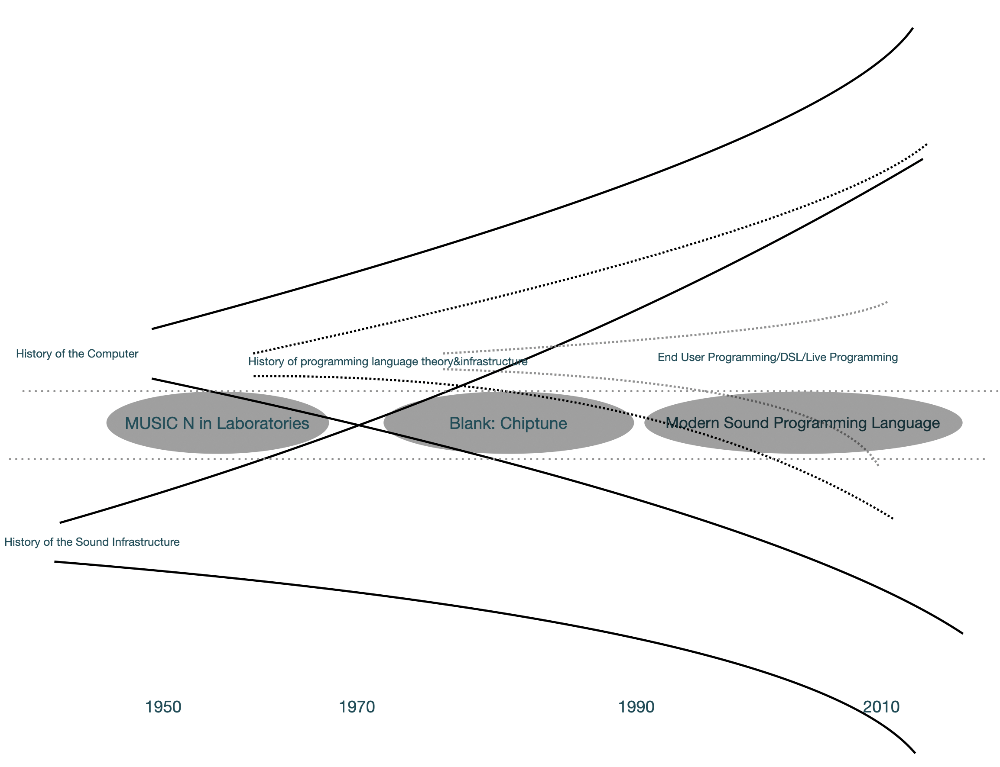

# イントロのイントロ

2021年9月。北九州市の植物園でこのイントロダクションを書いている。

植物園、というか自然公園みたいなこの場所にはフリーランスの仕事で来ている。公園を大きく使ったナイトウォークのようなイルミネーションのようなイベントで、そのための音楽やSEを流すためのシステムを作る仕事である。仕事の半分くらいはスピーカーをどこに配置するかとか、どの機材を使うかとかそういう話なのだが、もう半分はその沢山あるスピーカーにどう音を割り振ったり、パソコンを起動したら自動的に音が鳴り始めるようにするためのプログラムを作る作業になる。

制御のためのソフトウェアはCycling'74社のMaxという音声処理が得意なマルチメディアプログラミング環境で構築している。長い歴史を持ち、現在音楽のためのプログラミング環境としては（知る限り）最も多く使われており、個人的には2015年から使い始めたこのMaxというソフトウェアを使うと、例えば展示空間にスピーカーを10個とか（それも、いわゆるサラウンドとかとは全然違うレイアウトで）配置してそれぞれに違う音を同期して流したりすることができる。あるいは、映像を生成するコンピュータからネットワーク経由で特定の信号を受け取ったら特定の効果音を流すようにしたり。

なんだか言葉にすると大したことがない仕事のように聞こえる。実際、プログラムを書く作業自体は主観的には大したことがないのだ（ソフトウェア特有のニッチな問題やらバグは細々あるにしても）。こんな作業でお金をもらってしまっていいんだろうかと思う時もある。

しかし実際のところ似たような仕事ができる人はそこまで多いわけでもないらしい。例えば、仕事を受けようとしたが予定が埋まっているときに別の似たような職能を持った人を紹介しようと思っても、パッと思いつく人はそう多くない。

これは、自分がこうした仕事に慣れすぎてしまったのだろうか。半分はそうなのだろうが、この仕事をしているとやはり考えざるを得ない疑問は、コンピューターはなんでもできる装置のはずなのに、たかだか沢山のスピーカーに同時にたくさん音楽を流すぐらいのことに、どうしていちいちこんな専用の（しかも有料の）ソフトウェアを使ってカスタムツールを使ってプログラムを作るような手間がかかる作業になってしまうのだろう、ということなのだ。

これは別に、使うスピーカーが多いから必要なコンピューター処理能力が大きい、という話でもない。例えば、映像インスタレーション作品でどうしてもフォーマット的に3chのスピーカーを制御したい、となったときにも、大体10chの時と同じくらいの面倒臭さが発生する。2chが3chになったりするだけで、普通の音楽制作ソフトウェアでは扱いづらくなる。なんでmacOSでファイルを選択してスペースバーを押したら音声ファイルが再生されるように、物理的なセンサーに触ったら音声ファイルを再生する程度のことに労力が必要なのか。なんでエクセルファイルをちょっと編集するぐらいの手間で10chのスピーカーに音声ファイルを割り振れるようにならないのか。

この疑問こそが、おそらくはインフラストラクチャやフォーマットの持つ力というものの説明なのだろう。つまり、人々は2chのステレオ音声のフォーマットがすでにあるから2chステレオで音楽を作る。作るためのツールも2chが一番主流なのでそれが最も作りやすいように良心的な配慮をしてしまう。それに、いかに音楽や芸術表現が新しさを欲するものだとしても、とりあえずはその2chのフォーマットの中で表現が可能な新しさであれば問題にはならない。そして、別に3ch以上の音声フォーマットも表現として”不可能なわけではない”。ただ、ちょっと手間がかかるのだ。

技術決定論者/あるいはマルクス主義者風の言い方をすればインフラストラクチャ:下部構造が上部構造ー、つまり音楽表現とかを規定するということになるのだろうか。おそらくはそうではない。インフラストラクチャは表現を完全に縛りはしないが**誘導**する。そしてその誘導方向は既存の上部構造によって作り出されるものであり、互いに循環し合いながら徐々に路面は踏み固められていく。

---

本論文は、音楽のためのプログラミング言語mimiumの設計と実装を通じて、あるべきコンピューターと音楽の関係性を考え直すものだ。

コンピューティング文化の研究では音楽は比較的先進的なテクノロジを先取りしてくるという議論もある。（参照先忘れたので考える、ジャックアタリとか、これゲームさんぽの水野佑さんでしたね）

<!-- だが、本論文ではあえて、現在の音楽文化のコンピュータの関係性(音楽におけるコンピュータの使われ方？)は本当に**マトモなのか**ということを大きなテーマとして考え直す。 -->

まず、コンピューターを用いて音楽の新しい表現を開拓していく、という進歩的な歴史の見方を否定したいということ。

それから、コンピューターも音楽も、人間によって生み出された物というよりも人間同士を仲介する道のような存在ではないかという意味合いだ。

# 研究領域

## 音とテクノロジー

## 音楽とテクノロジー

## 音とコンピューター

## 音楽とコンピューター

## 音とプログラミング

## 音楽とプログラミング

## 音、音楽とプログラミング言語

# mimium制作までのバックグラウンド

本研究の主題となる音楽プログラミング言語mimiumの開発は2018年頃に遡る。

個人的な動機の話にはなるが、筆者のバックグラウンドはコンピューターサイエンスではなく、音楽プログラミング言語を作り始めようと思ってからプログラミング言語理論を学び始めたという順番を取っており、そのバックグラウンドが音楽プログラミング言語研究の方法論自体の見直しという本論文の大きなテーマの一つにも大きく影響してくるのでその経緯を簡単に記しておくことにする。

2018年の9月から11月にかけて、筆者はSchool for Poetic Computation(SFPC)という、ニューヨークにあるアーティスト・ラン・スクールへ留学した。SFPCはテクノロジーと表現を批評的に、かつ実践的に学ぶ私学校のような場所で、年に2回、20人ほどの学生（10代から50代まで幅広い）が集まり、Openframeworks[^openframeworks]を用いたプログラミングからポストコロニアルスタディーズを起点にした技術批評の文献購読までを3ヶ月間、対話を交わしながら進めていくものだった。

[^openframeworks]:openframeworks

筆者はそれまで、物理モデリング楽器を物理的な要素で再構築するインスタレーション作品の制作や、オーディオフィードバックを主要素とする電子音響楽器の開発とそれを用いた即興演奏などを中心に活動してきた。

これらの作品制作への大元のモチベーションは簡単に言うならば、どれだけ工夫したプログラムを作ったところで全ては2chのステレオPCMサウンドというフォーマットに収束してしまうことへの窮屈さから来る、より異なる音楽表現の可能性の追求であった。つまりインスタレーション作品も、オーディオフィードバックを用いる電子楽器も、コンピューターにスピーカーを繋げるだけでは実現不可能な表現領域を探索することに意義を見いだしていた。

しかし同時に、音楽のフォーマット（あるいは、より広範な意味合いでの"形式"）から離れたところで、インスタレーションや、展示、あるいは即興演奏のイディオムという異なる形式へと従属する対象が変わっただけのようにも感じていた。

そうした疑問を抱えながら過ごしたSFPCでの授業は全くこれまでと違う考え方を自分に与えてくれた場所であった。

SFPCの入居しているウエストベス・アーティスツ・コミュニティという建物は、元々1890年代から1960年代までベル研究所の建物だった場所で、有名なところではショックレーらによる切開で初めてのトランジスタが発明された場所でもある。そして同時にこの場所はニューヨークのテクノロジー・アートの歴史の中心地と言ってもよい歴史的な経緯を持つ場所でもある。

ベル研究所のエンジニア、ビリー・クルーヴァーは美術家のロバート・ラウシェンバーグとともに、60年代にExperiments in Arts And Technology(E.A.T)というアーティストとエンジニアの共同作業のための集団を組織し、《九つの夕べ》や、1970年の大阪万博ペプシ館の演出を担当するなど、のちのテクノロジーを用いた芸術制作へと大きな影響を与えている。こうしたニューヨークにおける技術者と芸術家の共同作業は、ラウシェンバーグを始め、ウエストベスにのちに入居するダンサーのマース・カニングハムや、彼らとの共同作業も行った作曲家のジョン・ケージやデイヴィッド・チューダーといったアーティストの参加したブラックマウンテン・カレッジ、またケージの参加したフルクサスのような、反制度、反形式的な思想や運動を背景としていることが特徴であり、これは例えば人類学者のジョージナ・ボーンが"Rationalizing Culture"で、フランスの電子音楽研究所において70~80年代にピエール・ブーレーズのような作曲家が電子音楽のための技術を、現代音楽という積み重ねられてきた歴史の上で正当化する過程を描いた様子とは大きく異なる[@Born1995]。

SFPCのプログラムはこうした歴史的背景をもとに、ブラックマウンテン・カレッジのような既存の教育の枠を外し、生徒が互いに教え合う機会を多く設けた"Horizontal Pedagogy"(http://taeyoonchoi.com/2012/05/notes-on-critical-pedagogy/)と呼ぶ学びの姿勢を重視したものであり、かつ、大阪万博を一つのピークとして捉えられる、60年代のテクノロジーアートにおける、表現に先行して技術を無批判に用いることや、大規模化するごとに資本主義に迎合していってしまう傾向[^mediaarthistory]への内省を踏まえたものとなっている。技術を用いる際に暗黙的に発生する政治性に自覚的になり、また技術を与えられたブラックボックスとせず、すでにライブラリやツールが存在しているものだったとしても一度自分の手で作り直すことによって体でその内容を理解することで、異なる技術のエコシステムの可能性を想像することができるようになるというわけである。

[^mediaarthistory]: 例えば、[@Ma2014,58p]の坂根厳夫の引用では、70年代はじめのオイルショックや環境問題を単に発した科学技術自体への批判との共鳴が指摘されているし、大阪万博ペプシ館でのスポンサーによる会期中のプログラム中断と、E.A.Tのその後の活動の衰退をあげることができるだろう。

# Problem Statement

音楽言語というブラックボックスがあること（知識的な）
それを開けても別の開けられないブラックボックス（UGEN）が残ること

# 方法論

音楽プログラミング言語、というよりも、コンピューターを創作に用いるための道具を研究するにあたって問題になるのは、それをどう評価するかということだ。

典型的には、作ったツールをユーザーに使ってもらって統計的に評価を出すという実証主義に基づいた量的な研究方法がある。
これらの方法には、特にヒューマン-コンピューターインタラクションにおける創作支援ツール(Creativity-Support Tool,CSTと略されることも)においては慎重になるべきである（なんか引用）。

ありもしない「ユーザー」を想定してしまうこと
追試による反証可能性を試したところで…という問題

質的研究方法（大谷など）　臨床医学の方で主に発達している。最近はHCIなどでもJacobsによる長期ユーザーテスト

あくまで（OSSで公開しているし、インフラ的な役割を重視しているとはいえ、）自分の製作を自分が検証する方法

Magunusson On Epistemic Tools(まぁこれもインタビュー調査とかしているけれども)

究極的には、今後音楽プログラミング言語を作る人のための道標になれると嬉しい。それも、単に作るための技術的知識だけでなく、なぜ作るのかということも含めた

大谷の議論にも、個人的制作のバックグラウンドを記述しておくことは資料としても有益なので記述しよう

# 本論文の貢献

本論文を通じて学術的に貢献する内容は以下のようになる。

まず、音楽プログラミング言語の存在論の提示だ。音楽プログラミング言語は歴史的にコンピューターを用いて音楽を生成するための技術としてスタートしつつも汎用プログラミング言語の理論を取り込んで発展してきたことにより、一重に音楽のためのプログラミング言語/環境といってもその応用範囲や想定される使用方法、さらに内部の実装方法までが多岐に及び、単純な比較をすることが難しい。また、評価のための語彙も"表現力が高い" "効率的" "汎用的"などの言葉が共通認識の無いまま慣例的に使われており、実際に何を意味するかもはっきりしないことがある。本稿ではまずこのような、"音楽プログラミング言語とは何か"、"音楽プログラミング言語にはどんな種類があるのか"、"音楽プログラミング言語の特性はどう記述できるか"といった概念を整理して提示する。

2つ目は、筆者が設計/実装した自己拡張性の高い音楽プログラミング言語"mimium"についての設計思想とその具体的な実装を提示することだ。mimiumは先述した音楽のためのプログラミング言語の歴史を見直し、汎用プログラミング言語の設計の上に最低限の音楽のために特化した言語機能を備える構造を取ることで音楽のための言語におけるブラックボックスを減らしながらもその実装の単純さと自己拡張性の高さを同時に実現できるように設計されている。

3つ目は、今後は音楽プログラミング言語を音楽を作るためのツールとしてだけではなく、メディウムとして流通させるためにも利用していくべきだという主張である。録音技術（音響再生産技術）に端を欲した音楽のフォーマットは現在空間音響技術のためのフォーマットによって、原音再現という従来の明確な一つの目標を失いつつある。その環境でコンピュータ上の表現の自由度を最大限担保するためにはプログラミング言語そのものを音楽のためのフォーマットすることが必要になってくる。

4つ目は、音楽プログラミング言語自体を学術的な研究とする際の異なる方法論の提示だ。音楽プログラミング言語の研究自体は、人文学的な動機で研究をされつつも、基本的には作ることで問題を解決する（≒できなかった表現をできるようにする）という、形式を取ることが多かった。本論文ではそうではなく、問題がなんなのかははっきりとはわからないままに作り始めることで、事後的に問題が浮かび上がってくる、質的研究法の中で言われるReflexivity（自己反映性[^reflex]）、つまり自分の研究内容によって自分自身が変化することを重視した研究である。今回の研究では、初めは音楽プログラミング言語という範囲の中での問題点という狭い視野で作り始めたものが、最終的には音楽におけるコンピューターの使い方全般の問題や、音楽流通におけるデジタルフォーマットの問題、テクノロジーにおけるブラックボックス性の是非といったより広い問題意識へと広がっていく過程をオートエスノグラフィーの形で（？）示すことで、

[^reflex]: Reflexivityという言葉は再帰性や反射性という訳語があてられることも多い。本論文中では計算機科学の用語としての再帰（Recursion）との不要な混同を避けるため、また、プログラミング言語において実行環境（コンパイラやインタプリタ）の挙動自体を実行コードからメタ的に操作できる機能のことをReflectionと呼び、日本語としては自己反映言語や自己反映計算と呼ばれることもあり、意味合いとしてはより類似しているように思われるため、自己反映性という言葉を用いる。

# 構成

## 三重の歴史の提示

第2章以降は以下のような構成で論じる。本論文全体の構造を図nに示した。

第2章ではコンピューターが単に計算の自動化のための装置から、70年代にメタメディア装置にへと変化しさらにその先にユビキタス・コンピューティングに代表される、コンピューターを不可視（Invisible）にする思想が醸成される過程を示す。
ここではメタメディアとしてのコンピューターが、ユーザーがプログラミングによって自分で機能を組み替えられるようになっていたことに本質的な点があったことを指摘する。その一方で、当時のメタメディアの音楽的な利用が既存の音楽表現のレールに乗っていることで成立していることにも言及する。

第3章では、現在の音楽インフラストラクチャに大きく影響を与えた録音技術