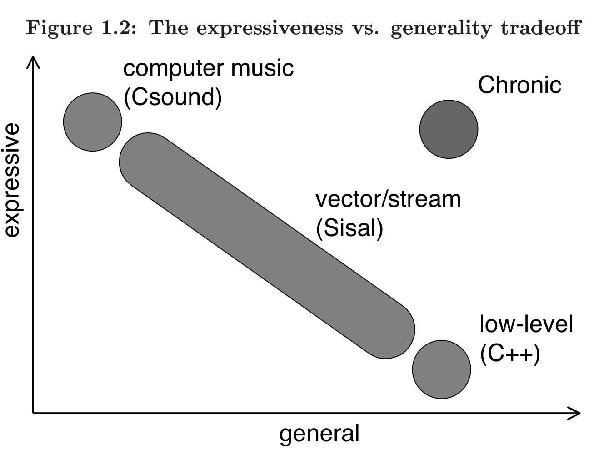
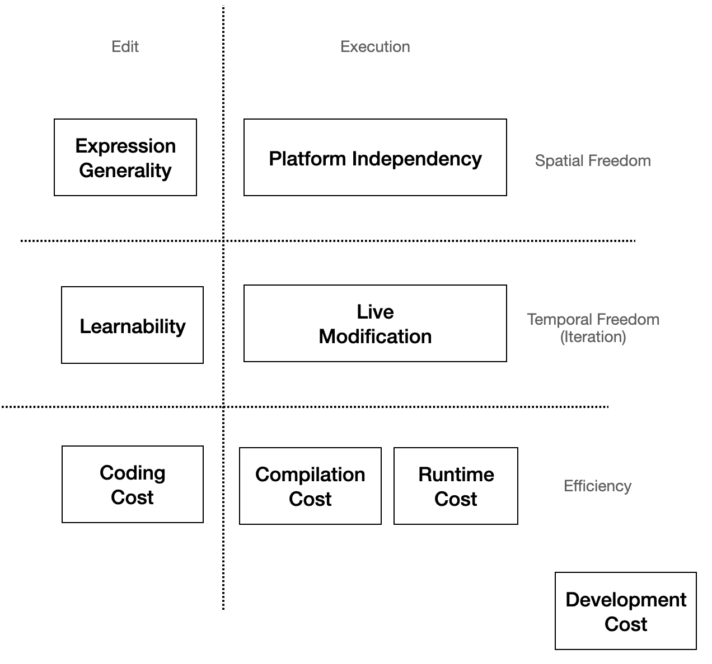

<!-- 第4章 音楽プログラミング言語の歴史と語彙の整理 -->

# 音楽言語設計におけるトレードオフーGeneral,Efficient and Expressive

2000年代以降のざっとした流れを見てきた

今後音楽言語を新しく設計するにあたってどんな課題に取り組むべきか？

そもそも評価するための語彙が整理されていないのが問題では

- General
- Efficient
- Expressive

トレードオフがあると言っている文献がいくつかある

Dannenbergは音楽のためのプログラミング言語を特徴付ける要素としてSyntax、Semantics、Runtime、Libraries、IDE(Interface?)、Community&Resourcesという6要素を挙げた。

一方で、こうした言語ごとの実装や設計における要素が、言語にどのような特性をもたらすのかについての整理はこれまで行われていない。汎用のプログラミング言語においてはCoblenz and et al.(2018)で、

- General
- Efficient "Execution cost"
- Expressive "To what extent can users specify their intent using the formal mechanisms of the language?"
- Modifiability "How easy or hard is it to adapt software to changing requirements?"
- Learnability
- Understandability
- Portability
- ...


といったobejectivesを提案しており、音楽プログラミング言語においてもこのような言語設定における目標を整理することで、より言語設計を明確に行うことができ、またその目標が達成されたかどうかの評価を客観的に行うことができるようになると考えられる。

特に、Coblenzらのobjectivesの中でも挙げられているGeneral、Efficient、Expressiveという3つの語は音楽プログラミング言語の設計の観点の中でもよく使われる用語でありながら、実際には指している意味が複数混在しているので用語を整理する必要がある。

例えば、Brandt2002は音楽言語設計における大きな問題としてExpressivenessとGeneralityのTradeoffが存在するとして、それらを両立するOCamlフレームワークChronicを開発している。

{width=70% #fig:chronic-tradeoff}

ここでのExpressivenessとは“ユーザーが読みやすく書きやすい”、 Generalとは“可能な表現の範囲が広い”という意味で用いられている。またChronicはOCamlというホスト言語の実行速度の問題もあって、リアルタイムで実行はできなかった。つまりChronicではgeneralとexpressiveの両立はできたが実行時パフォーマンスという新たなトレードオフが発生していたことがわかる。

またLazzarini2013ではCSoundの設計において、Score、Orchestra、Instrumentという3種類の内部言語を用いるアプローチにおいて、

> 音楽プログラミングにおいて多言語アプローチを取ると、ユーザは**汎用性(Generality)**と**効率性(Efficiency)**のバランスを取りやすくなる、

と述べている。ここでの用語は、続く以下の説明を参照すると

> タスクに応じてプログラマは異なる複雑度のエントリーポイントを選択することが可能になる。より低く汎用的なレベルではより複雑なコードの設計が必要だが幅広い結果を得られる。一方、より高い、特殊化、具体化されたレベルではプログラミングに必要な労力という観点からプロセスはより効率的になるだろう。

ここでのEfficiencyはCoblenzらの論文におけるEfficiencyとは異なり、ユーザーが目的のプログラムを構築するまでの効率のことを指している。これはむしろCoblenzのLernabilityやMcphersonらの分析におけるRapid-Prototypingのしやすさに相当するものだと言える。


Dannernberg2018

> This article considers models of computation that are especially important for music programming, how these models are supported in programming languages, and how this leads to **expressive** and **efficient** programs. 

ここでのEfficientはprogramsに掛かっているのでRuntime Costのことを指していると推察できる。

このように、同じEfficiencyというワードでもComputerが負担するコストとユーザーが負担するコストという異なる事項を指している場合があることがわかる。そこで、次の項では音楽プログラミング言語を評価、また設計の指針となるためのvalueを、ユーザーがソースを編集し、実行し、そのフィードバックが帰ってくるhuman-in-the-loopシステムとしてモデル化し、その際に考えられるコストや自由度をユーザー、コンピューターそれぞれの観点で分類することで提案する。

# 音楽プログラミング行為のモデル化と評価語彙の提示

{width=70% #fig:humanintheloop}

{width=70% #fig:tradeoff}

​ユーザーへのフィードバックが音を出す前にわかる場合と、音を鳴らして初めてわかるものとある（型チェックとか）

## User-Side

学習しやすさ

表現可能な空間の広さ(Generality)がMcpherson2020におけるOpen-Endedness、BrandtにおけるGeneralityにあたるものと言える。

ユーザーが必要とするコーディングコスト、すなわちユーザーが想定している表現にどれだけ簡単に辿り着けるような言語仕様になっているかどうかがExpressivenessにあたるものと言える。

## Computer-Side

Compilation cost

### コンピューターが必要とするコスト（Runtime Efficiency/Execution Cost）

### 実行可能な空間の広さ（Portability）

## Edit-Executeの繰り返しやすさ

### ユーザー側：Learnability

### コンピューター側：Dynamic Modification

(Mcpherson2020におけるRapid-Prototyping、Mcpherson2020のDynamismは実行中に動的にUGenのデータフローを作り替えられるかどうかという話なので少し違う)　ここが極まるとLive Codingになる

### Development自体のしやすさ

C++とかで作られてると大変、インタプリタ型なら簡単

言語の自己反映性が高ければ言語自体のコーディングしやすさと一致してくる（機能拡張がライブラリを書くことで可能になる）

## それぞれのトレードオフ

10個全部を満たすのは無理、少なくとも全部を撮ろうとするとDevelopmentが超大変

他、具体的には（ここを綺麗に整理できたら嬉しい）

- インタプリタ型の実装だとEdit-Executeの変更はしやすくなる、その代わり信号処理とかをスクラッチで実装するのは実行コストが嵩む
- 


# 実装方法からの音楽プログラミング言語の分類-DSLのデザインパターン

一般的にプログラミング言語は、テキストの文字列データを解析して構文木と呼ばれるデータ構造に変換し、それを直接評価することで実行したり（インタプリタ型）、より低次の中間構造、例えばvirtual machineへの命令列やC言語のような汎用言語のソースコードなどへの段階的な変換を経て実行される場合がある。

音楽のためのプログラミング言語もこうした実装に則っているが、構文解析の部分はホスト言語(その言語自体を開発するための言語)の機能を利用しており、ライブラリのような形で実装されるものもある。構文解析から行うものをExternal DSL,ライブラリのような形で実装するものをInternal DSLと呼ぶこともある（Nishino2015）。

External,Internalといった実装のアプローチの違いをSpinellis2000はデザインパターンとして提示した。そのうちの一部を取り上げる。

- 文字列解析(一番自由度は高いが大変)
- 言語拡張（ホスト言語のライブラリとして実装）
- 言語特殊化（ホスト言語の一部の機能だけを使う）
- Source to Souce Transformation
- Pipeline

言語拡張、言語特殊化の表現の範囲は、言語を実装するためのホスト言語の自由度（演算子のオーバーロードができるか、高機能なマクロが使えるかなど）にも左右される。

例えばSuperColliderの文法をCoffeeScript（Javascriptに変換され実行する言語）で模したWebブラウザ上で動作する音声処理ライブラリ/DSLであるCoffeeColliderは文字列解析などは自分では行っておらず、特定のオブジェクトに対する+演算子や*演算子の挙動をオーバーロードしたりすることで、CoffeeScriptの文法で可能な範囲の表現でSyntaxを模している。

```coffeescript
(->
  noise = PinkNoise.ar(0.2)
  noise = Mix Array.fill 10, (i)->
    Resonz.ar(noise, i * 800 + 200, 0.05)
  noise = (noise * 0.2 + noise * Decay.kr(Dust.kr(0.5), 10))
  noise = RHPF.ar(noise, LFNoise0.kr(0.5).range(220, 880), rq:0.001)
  CombL.ar(noise, delaytime:0.5, decaytime:25).dup() * 0.5
).play()
```

このExampleをSuperCollider本来の記法で書いたのが次のコードだ。

```smalltalk
{
   var noise = PinkNoise.ar(0.2);
   noise = Mix.new(Array.fill(10, {arg i;
     Resonz.ar(noise, i * 800 + 200, 0.05)}));
   noise = (noise * 0.2 + noise * Decay.kr(Dust.kr(0.5),10));
   noise = RHPF.ar(noise, LFNoise0.kr(0.5).range(220, 880), rq:0.001);
   CombL.ar(noise, delaytime:0.5, decaytime:25).dup() * 0.5
}.play;
```

SuperColliderでの`{}`で囲むことでオブジェクトを生成するシンタックスを、CoffeeScriptにおける無名関数`(-> statements)`によるオブジェクト生成で似せていることがわかる。

<!-- ブログ記事から写したので語調を直す -->
## 演算子オーバーロードと自己反映性

さて、coffeecolliderの何が面白かったかといえば演算子のオーバーロードを積極的に活用することでテキストをパースするプログラムを書くことなく、CoffeeScriptそのままで記法を可能な限りSuperColliderに近づけているという点だ。

演算子のオーバーロードとは、たとえば`+`や`*`などの二項演算を数値の加算乗算やテキストの結合などの言語組み込みの型だけではなく、自身の定義したカスタム型に対して新しく振る舞いを定義してやれるような機能のことです。

たとえば、Number型2つで構成されるの2次元ベクトルの型を定義したら+演算子を使ったら要素同士の加算をやってくれたり、`*`演算子を使ったら直積、内積とか外積を計算できるようにしたらコードの記述が短くなってありがたいですね。

演算子のオーバーロードができるようになっている言語としてはたとえばC++、Scala、Haskellなどが有名です。とくにHaskellでは、あらゆる関数を中置演算子のように使える上に`!  #  $  %  &  *  +  .  /  <  =  >  ?  @  \  ^  |  -  ~`あたりの文字から好きな文字を好きなだけ組み合わせて演算子を作ることもできるので`<=>??@`演算子のようなオレオレ演算子をほぼ無限に定義できてしまいます。

JavaScript本体には演算子オーバーロードがないので、Tone.jsの記法は「やっぱりJSだな〜」という印象が残る一方、CoffeeScriptには演算子オーバーロードがついているのでここまでアグレッシブに記法を変えることができるわけです。今から新しく作るならAltJSでほぼHaskellのような文法が書けるPureScriptなら中置演算子の定義が可能なので面白く使えるかもしれません。

演算子オーバーロード以外のこうした言語自体の意味を自己拡張するような機能はたとえばKotlinの[Type-Safe Builder](https://kotlinlang.org/docs/type-safe-builders.html) とかF#の[Applicative Computation Expression](https://docs.microsoft.com/ja-jp/dotnet/fsharp/whats-new/fsharp-50#applicative-computation-expressions)とかでしょうか。後はマクロもそうですね。

こうした言語の意味を拡張していくような言語機能は場合によっては自然な記述を可能にしますが、場合によっては同じ言語で書いてあるのに、書き方が違いすぎて何が書いてあるんだかまったくわからないカオス状態に陥ったりもします。汎用プログラミング言語の範囲内での現実的な利用価値としては諸刃の刃です。代表例はC++のストリーム読み書きのための`<<`演算子とかでしょうか。C言語から移ってきた人がHello Worldしようとして何これ？となるやつですね。

```cpp
#include <iostream>
int main(){
  std::cout << "Hello World!" << std::endl;
  return 0;
}
```

C++でこういう使い方を極めた一例はパーサー記述ライブラリ[Boost.Spirit.Qi](https://www.boost.org/doc/libs/1_75_0/libs/spirit/doc/html/spirit/qi/tutorials/mini_xml___error_handling.html)とかですね。だいぶ悪魔っぽい。

なので、言語設計としてはgoとかのように意図してオーバーロードを禁止することで、ソースの見た目の一貫性をキープする方針も珍しくありません。

## TidalCycles - ハイブリッドなアプローチ

またTidalCyclesのように文字列解析、言語拡張、言語特殊化を組み合わせて実装されることもある。

```haskell
d1 $ sound "bd*4" # gain (every 3 (rev) $ "1 0.8 0.5 0.7")
```

- $や#はホスト言語であるHaskellにおける中置演算子(**言語拡張**)
- soundやgain、everyなどはHaskell上でライブラリとして定義された関数
- “”で囲まれた部分はHaskell上ではただの文字列
- ParsecというHaskellの**字句解析**ライブラリで内部的にパースしている
- ユーザーはHaskellの関数定義や型宣言など高度な文法を知る必要はない（**言語特殊化**）
- TidalCyclesはSuperColliderに対してOSCを送り音を出す(**パイプライン**)

一般的には中間表現を低次へ変換していくほどより抽象的な操作に近づいていくので言語処理系の実装が汎用言語の実装に近くなっていく。

またMaxやPuredataのようなビジュアル言語の場合は、保存されているテキスト/バイナリデータを解釈してビジュアルインターフェースとして表示する評価と、音声処理のためのデータ構造としての評価と2方向の評価が行われていると解釈することができる。この時の保存されているデータ形式は例えばMaxではJSONというJavascriptのための汎用データ表現形式を用いているように、その言語のSemanticsとは関係のない汎用的なデータ構造を利用している場合もある。

### DSLの中でも、音楽特有の問題 - なぜライブラリとしてのDSLではダメなのか？

HaskellみたいなDSL作りやすい言語で全てライブラリとして実装しちゃダメなのか？→基本的には厳しい

OSのプリエンプティブスケジューリング（ユーザプログラムが時間に関与できない）

​	例外- Xenomaiの様なカーネル拡張

信号処理中にヒープメモリ確保をできない問題


- テキストをパースするプログラムを書かなくてもライブラリでもホスト言語が演算子オーバーロードのように自己拡張する仕様を持つ場合DSLとしての性質を帯びさせることができる。
- パースするプログラムをゼロから書いた方が言語設計の自由度は高まる一方で、実装のコストが高くなる。さらにユーザーとしてもまったく新しい言語を1から勉強することになるので学習コストが高い。

SuperColliderを開発したJames McCartnyは2001年の論文で、究極的には言語の開発そのものは必要ないと述べています。

> コンピュータ音楽に特化した言語は実際必要なのでしょうか？少なくとも理論的には、私はそうではないと思います。今日の汎用プログラミング言語で利用可能な抽象化の方法の集まりは、コンピュータ音楽を便利に表現するフレームワークを構築するのには十分なものです。ただ残念なことに、実用的には、今日利用可能な言語の実装として欠けている部分もあります。多くの場合、ガベージコレクションはリアルタイムでは実行されず、引数の受け渡しはあまり柔軟ではありません。遅延評価が含まれていないと、パターンやストリームの実装がより複雑になります。SuperColliderを書いたのは、コンピュータ音楽のために柔軟に使えるような抽象化のセットを持ちたいと思ったからです。将来的には他の言語の方が適しているかもしれません。SC Serverの合成エンジンと言語を分離する目的の一つは、SuperCollider言語とクラスライブラリで表現されている概念を他の言語で実装することを模索することができるようにすることです。他にも、将来的にコンピュータ音楽のために面白い可能性を秘めた言語として、 OCaml (www.ocaml.org)、Dylan (www.gwydiondylan.org)、 GOO (www.googoogaga.org)、そして、偶然にも文法規則の多くに似た仕様を持つスクリプト言語であるRuby (www.ruby-lang.org)があります。[@McCartney2002]


つまりわざわざSuperColliderという言語を実装したのは1990年代にはリッチな機能を持つ言語がそんなに存在しなかったのでわざわざ言語をゼロから作る羽目になった、というような感じなのかもしれません。そして実際、後半で述べられているようにSuperColliderという言語そのものを積極的に利用する人は少なくなった一方、音声合成エンジンとしてのSCServerはさまざまな形で利用され、音楽言語のインフラストラクチャとして機能しています。[FoxDot](https://foxdot.org/)はPython、[Overtone](https://overtone.github.io/)はClojure、[TidalCycles](https://tidalcycles.org/)はHaskell、[Sonic Pi](https://sonic-pi.net/)はRubyといったように実際に多様なホスト言語から利用されています。

もっとも、SuperColliderのプラットフォームに乗っかることで生まれる限界も当然存在します。典型的な例ではサンプル単位で正確なイベント処理を行う必要があったとき、SCではオーディオとメッセージを明確に分離している（`.ar()`と`.kr()`）ので時間方向の解像度に限界が存在します。これらの問題にアプローチしたのが[ChucK](https://github.com/ccrma/chuck)のような言語です。この辺りはプログラミングにおいて正確に時間を扱うことの難しさという根本的な問題が存在しているのですが、それはまた次回。
