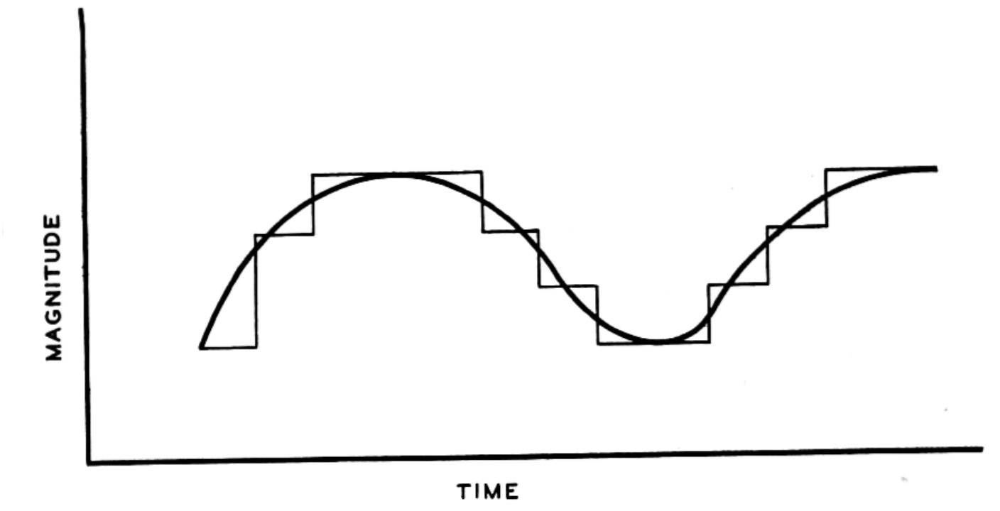

# PLfMの歴史の主な時代区分

さて、PLfM

まずは、既存の音楽のためのプログラミング言語に関するサーベイの内容について軽く触れておく。

既存の音楽のためのプログラミング言語や、コンピューター音楽のためのシステムのサーベイとしては[@Roads2001]や[@Nishino2016]が存在する[^authorsinfo]。

[^authorsinfo]:なお、西野はLC[@Nishino2014]の、ダネンバーグはNyquist[@Dannenberg1997]他多数の言語の設計者でもある。このことからもやはり、音楽プログラミング言語の歴史を記述するには基本的にその設計や実装に関する知識や経験が必要になっていることが窺える。

ローズによるコンピューター音楽の手法を網羅的に記述した著書では、（原題：Computer Music Tutorial）初期のコンピューター音楽の試みが過去のインタビュー[@Roads1980]なども踏まえて記述されている。

NishinoとNakatsuのサーベイではこれよりも詳しく、1940年代から2010年代まで時系列順でコンピューターを用いた音、音楽生成の試みの歴史が網羅的に記述されている。

また田中による著書では、チップチューンと呼ばれる、80年代の初期パーソナルコンピューターやゲーム機において用いられていた、音声生成用のICチップを利用した音楽に端を欲した音楽ジャンルに関する歴史の起源として、40〜60年代までのコンピューター音楽黎明期の記述が詳しくなされている[@Tanaka2017]。[^chiptune]

[^chiptune]: 本研究内であまり触れられなかったが、チップチューン自体はいわゆるコンピューター音楽の歴史としては日本での独自の発達もあり、田中も記述するようにいわば傍流の歴史としても扱われているが、その文化の中から生まれたMML（Music Macro Language）と呼ばれる、テキストで音楽の内容を記述するための言語の系列は、そのハードウェアやプラットフォームごとに仕様が異なる派生の複雑さや、ゲーム音楽研究との接点、その後のTakt[@Nishimura2014]のような、より汎用プログラミング言語の理論へ近づいた言語の存在を考慮すれば、音楽のためのプログラミング言語の歴史研究の中でより今後詳しく研究されるべき重要な分野である。

本研究ではこれらの研究を参照しつつも、3章で見てきたメディア装置としてのコンピューターと、パーソナルコンピューティングの歴史との対応関係から、時代ごとの言語の特性をより明確に描き出すことを試みる。
そのために本章では、PLfMの歴史的推移の大枠を捉えるために3つの視点での区分を導入する（1.2.は西野らのサーベイで使われていた観点である）。

1. **リアルタイム性**。一度結果を書き込んでから読み出すのではなく、実時間で音声信号の処理ができるかどうか。（そもそも音声信号処理をしない、というのも含め)
2. **可変DSP**：音声合成のためのモジュールが有限か、（理論上）ソフトウェアで無制限に利用できるか。
3. **Lab or PC**：研究所における取り組みかパーソナルコンピューティングか

これらの取り組みが歴史的にそれぞれ異なる方向性の試みが重なるように行われてきた。[@fig:plfmhistory]にその概略を示した。

{#fig:plfmhistory width=100%}

50~70年代の計算機自体の黎明期は全ての信号処理をCPU上で行うと、例えば10秒の音声信号の計算結果を得るのに10秒以上かかってしまう状況だった。そのため、研究内容は例え非リアルタイムだとしてもソフトウェア上で音声を計算して合成する可変DSPを重視した試みと、それよりも、たとえ限られた範囲での合成しかできなくともリアルタイムインタラクションを重視する試みという、トレードオフの選択があった。この両立は研究所レベルでは1984年のIRCAM 4Xというワークステーションによって成されたというのが一般的な認識だ。

そして、80年代以降のパーソナルコンピューターの黎明期は、個人向けの低価格コンピューターにおける計算機リソースという制限から70年代までの研究所における状況が繰り返されていた。つまり、音声合成ICによる限られた範囲での音楽制作の試みである、チップチューンがこの部分に当てはまる[^nonrealpc]。

[^nonrealpc]: もっとも、パーソナルコンピューティングにおいて、ノンリアルタイムであったとしてもチップチューンより広い範囲での音声合成を、ソフトウェア上で行うような取り組みが行われてきた例が存在するのかはさらなる研究が必要な部分だ。

# Computer Music in Laboratory

電子計算機の黎明期における、PLfMの起源となるコンピューター音楽の試みは、やや矛盾するようにも見えるがプログラミング言語という道具がコンピューター史上に登場するよりも早い。

世界で初めて音楽にコンピューターを利用した例、というのを考えるのは、世界初のコンピューターは何かという論争や、世界で最初のアルゴリズミック・コンポジションとは何かといった命題につながってしまいキリがなくなってしまうので、ひとまず本稿で扱うのはENIAC以降の電子計算機、つまり真空管を用いてHIGH/LOWの2値をスイッチングすることで任意の計算を行える機械が誕生して以降の計算機群についての事例に限定することにする。

はじめてコンピューターを用いて音楽を鳴らした最初期の例としては、イギリスのコンピューターBINAC、アメリカのUNIVAC I、オーストラリアのCSIRACなどの事例がある[@Dournbush2016]。これらはもっぱらデバッグ目的で取り付けられていたスピーカーに2値の信号をマスタークロックの周波数から逆算して規則的な周期で送ってあげれば、任意の音程の信号が出せるだろうという考えで作られたものだ。そのため、任意の音程やリズムを奏でることはできるが、レコードのように任意の音圧波形を想いのままに作れるというわけではなかった。そのためこれらの取り組みは音声合成のための計算ユニットを備えていたわけではないとはいえ、限られた計算資源で、リアルタイムで合成可能な範囲（＝ピッチとリズムの制御）の表現に注力したFixed DSPの類型のひとつに分類できる。

コンピューターを用いて任意の波形を生成するという課題に最初に真正面から取り組んだのがベル研究所のマックス・マシューズらによるMUSICシリーズである。

MUSICがそれ以前のシステムと異なっていたのは、パルス符合変調（PCM）と呼ばれる、音声波形を一定時間に分割（標本化）、各時間の音圧を離散的な数値として表す（量子化）、今日のコンピューター上における音声表現の基礎的な方法に基づいた計算を行ったことだ。パルス符合変調の元となる標本化定理はナイキストによって1928年に示され[@Nyquist1928]、パルス符合変調はReevesにより1938年に開発されている。

この考え方を簡単に表したのがHartley1928における[@fig:hartley_pcm]である。時間を横軸、音圧を縦軸にとった音声波形のグラフをグリッド状に区切り、連続した数値を離散化された数値のリストに変換する。区切るグリッドが少ないほど、実際の波形との誤差が量子化歪みとして現れる一方、グリッドを細かくするほどに必要なデータの量は増えていく。また、標本化定理より、例えば1000Hzの周波数成分までを持つ波形を標本化するとき、その2倍である2000Hz以上、つまり横軸のグリッドを2000分の1秒より細かく設定する必要があることが知られている。例えばサンプリング周波数が1800Hzだった場合、表現できるのは900Hzまでとなり、1000Hzの正弦波をこのサンプリング周波数で標本化すると$1800-1000=800Hz$の信号が折り返し歪み(エイリアス信号)として現れてしまう。

人間の知覚できる周波数の上限が20000Hz程度となっているので、その2倍である40000Hz以上の標本化周波数で、かつ量子化歪みが十分に少なくなるように量子化ビット数を決めておけば、人間が近くできうる範囲ではおおよそどのような波形でも数値として表現できるということになる[^compactdisk]。

実際には連続した波形を離散化するだけであればこのような考え方の考慮で十分なのだが、標本化/量子化した波形同士を演算する場合にはもう少し細かい事情を考慮する必要があるため問題点も指摘されてきており[@Puckette2015]、音楽プログラミング言語設計の根幹にも関わってくるのだが、それはのちに議論する。

[^compactdisk]: 例えばコンパクトディスクの規格などはこういった考慮から標本化周波数44000Hz、量子化ビット数16bitと定められている。なお、サンプリング周波数や量子化ビット数を意図的に荒くすることで得られる可聴範囲の歪みを利用した表現が今日ビット・クラッシャーと呼ばれるエフェクトである。

<!--図 清書したほうがいいかも -->

{width=70% #fig:hartley_pcm}

MUSICはIからVまでの5バージョンが存在している。

1957年に作られたMUSIC IはIBM 704というコンピューター上で動作する、対称系の三角波の波形に対してエンベロープを掛ける程度の波形の合成ができるシステムだった。この頃のシステムはリアルタイムで波形を電気信号として生成しスピーカーを鳴らせるようなものではない。まずMUSICのプログラムをコンピュータが利用できるIBM本社まで持ち込み、計算結果を磁気テープにバイナリデータとして書き出し、磁気テープをベル研究所に持ち帰り、そこにあった真空管製の12bitデジタル-アナログコンバーターに通してはじめて音が出せるようなシステムになっていた[@Roads1980;@Roads2001]。

MUSIC Iの時点でのサンプリング周波数について記述されている文献はいないが、後年のIBM 7090上で動作していたMUSIC IV(1963年)では、同様に12bitでの量子化で、実際の計算速度が1秒間に5000サンプル程度が性能の限界だったのに対し、実際に計算結果を再生するときにはそれを1秒に30000サンプルに早回しすることができたと記述が残っている[@Mathews1963]。

MathewsはMUSICを制作するにあたって、シャノンらが示した標本化と量子化によって、考えうるあらゆる種類の音が計算によって生み出せる、それもこれまで既存の楽器では奏でられなかったような新しい種類の音が作れることに強く関心を持っていたことを語っている。

> 本質的に、サンプリング理論はサンプルから音を作るにあたって本当に限界が存在しないことを示している。人間が聴くことのできるあらゆる種類の音を、正しい数値、正確性、サンプルの組み合わせによって作ることが可能であるため、コンピューターは普遍的な楽器なのだ。他の楽器は、例えばバイオリンなどはとくに、美しく愛らしいものではあるとはいえ、常にその音はバイオリンのような音しか出せないし、最低でもバイオリンじゃないような音を作ることがとても難しい。[@Park2009,筆者訳]

後半の発言はほとんどトートロジーのようにも聞こえるが、実際コンピューターが理論的には無限の種類の音を出せるということはクセナキスをはじめとしたコンピューターを音楽に応用する可能性を肯定するものたちの典型的な謳い文句ではある。

また彼は同時に、自身がバイオリン演奏をしていたが決して演奏が巧くはなかったため、身体的卓越を必要としない仕組みを作りたかったこと、さらに作曲家が曲を作ってもオーケストラに演奏してもらえる機会がなければ発表できなかったり、何年も経ってからようやく初めて演奏されるという状況に対するひとつの解として、作曲したものをコンピューターに演奏させるという2つのモチベーションを挙げている。

> 私の興味は2つあった。
> ひとつは、私はバイオリン演奏をいつも楽しんできたが、それは人生のうちほとんどはアマチュアの弦楽四重奏の中でのことで、決して巧くはなかった。だからほとんどの楽器が要求してくる、そういった手先の器用さ〔manual dexterity〕をほとんど必要としないような、より良い音楽が作れるようになりたかった。
> またこれまでたくさんの作曲家がオーケストラのための曲を書いたが未だに一度も演奏されたことがなかったり、何年も経ってからやっと演奏されたという状況があるのを感じていた。だから（コンピューターが）作曲家が書いたものをほぼ即座に聴けるような手段を提供できるのではないかと思った。

<!-- 
> My interests came from two things. 
> One was that, although I’ve always loved to play the violin and I’ve had an amateur string quartet going most of my life, I was never very good at it, and so I wanted to be able to make better music that didn’t require such manual dexterity as almost all [musical] instruments require. 
> I also felt that there were many composers who would compose a piece for an orchestra and who would never hear the piece, or its performance would be delayed for years, and so [the computer] would provide a way for composers to write something and hear it almost immediately. -->

これらコンピューターを音楽に用いる3つの理由を簡単に言い換えると次のようになるだろう。

まず1つはこれまで存在しなかった新しい音楽の探求だ。これはサンプリング定理に基づくものでない、音価レベルでのアルゴリズミック・コンポジションにも共通して言えるモチベーションと言える。2つ目は身体拡張、あるいは自動演奏の追求である。これは今日のNew Interfaces for Musical Expressionにおける研究のような、コンピューターを用いて音を生成するための身体との境界面：インターフェースを作ることによって音楽と身体の新しい関係性を発見するものだ。これは最終的に1つ目の新しい音楽表現につながることもあるが、逆に、表現自体はこれまでも存在していたが演奏に高度な技能が必要とされるものを誰でも演奏できるように…といったモチベーションにも読み替えられる。

そして最後の作曲家のためのオーケストラに代わるものとしてのコンピューターとしての視点は、クイック・プロトタイピングのしやすさと表現するのがわかりやすいだろう。ただし、もう少し本論文の興味に引き付けて読んでみると、**コンピュータ以前はオーケストラという装置が（とくにクラシック音楽に由来する）作曲のインフラストラクチャとして機能していた**という視点を導入できる。つまり、有名な作曲家であればオーケストラに頻繁に演奏してもらえる機会に恵まれ、そうでなければ作曲家は楽譜上に音を配置し、ピアノなど少ない数の楽器である程度のシミュレーションをしながら作曲することしかできないという状態だったと言える。特に実験的な作品、すなわち既に共通して使われている楽譜上の記述では足りない表現を指示しようとしたり、大人数が演奏してみてはじめて曲の修正ができるような複雑な作品を作ろうとしたときにはオーケストラに実際に演奏してもらえるか否かは思い通りに作品が作れるかどうかに大きく関わっていたということができるだろう。

<!-- 録音音楽黎明期における、オーケストラ演奏を代わりに演奏してくれる装置としての利用法 -->

# Unit Generatorとモジュラーシンセサイザーの関係性

MUSICシリーズにおいて触れておくべきことは、MUSIC IIIにおいてはじめて**Unit Generator**と呼ばれる、今日まで用いられる概念が登場したことである。Unit Generator(UGen)とは、簡単にいえば正弦波や三角波、矩形波などの発振器や、各種フィルターといった信号処理における基礎単位を抽象化したものである。

これは

、MUSIC IVにおいてはじめてそれ自体の実装が汎用プログラミング言語(FORTRAN)で実装されたことである。

まず、Unit Generatorとは〜

# ボーンのIRCAM 4Xプログラミングの分析

リアルタイムで処理できない程度に重かったこと
楽器のモデルを計算できる理論が存在しなかったこと→Rissetに始まる物理モデリング合成研究（Analysis-Synthesisアプローチ）

80年代にしては計算のシンプルさに対して複雑な音色が出せるFM合成とかはあったが、コンピューター音楽言語は大学や研究所に限られていたし、リアルタイム性にもまだ欠けていた extreme mediation, both temporal and conceptual

モデルがしっかりしていないと音を改善することができないけど、トライ&エラーに時間がかかるのでモデルの妥当性を確かめるのにも時間がかかってしまうパラドックス

学生がCmusicで適当に音量をデカくしたせいでfoldover歪みが発生していたが、それが案外良かった→しかしシステム側で発生した歪みだったので再現できない 本当はなんでもできるはずのコンピューターが何故！

技術のトリクルダウン　研究所でパイオニア的テクノロジーが発達し、それがコマーシャルに低価格化していくという考え方をIRCAMは持っていた

ヤマハの人がCXのデモにIRCAMにきた話

4xは当時最強のスペックだった→これ何がそうさせたんだろう？オシレーターとかはソフトウェアで仮想化できたんだろうか？西野の文献読む必要あり→できた。Variable Digital Signal Processorの話

OSから作ってた　ハードは凄かったがソフトとペリフェラルが弱い

Chant 歌声合成、Formes PatchworkとOpenMusicの手前

Chant／Formesのグループからは、音楽概念の高度な発達というコンピューターのポテンシャルを無視していると思われてた

Chant/FormesはLISP製、VAX/UNIXシステムで動いていたノンリアルタイムシステム
    users could create their own "personalized environment"
    object oriented

The use and the development of software involve the writing of coded instructions within a software language or the creation of a completely new language, within the context of a hierarchy of such languages. At each of the hierarchy a traslation occurs between any two adjacent language or levels of code. Instructions from the language at a higher level mus be translated into aform whereby they can be "read" and executed by the lower-level code or language without any (or with minimal) loss of "meaning"

The hierarcy of codes that normally operates in computer software include, at the lowest level, machine code, the instructions that drive athe hardware, writtedn in binary form; at the next level up, assembler code, made of mnemonic abbreviations of machine code; above this, the general operating system that provides a basic framework and set of servicies; and above this, any of the major lkanguages such as FORTRAN, Pascal, C, or LISP.

〜〜

Computer music software such as that used and produced by IRCAM adds yet a further level of mediation, hierarchy, and translation, sincce the music languages are themselvels based upon, or written in, established general languages.

Thus, Music V is written in FORTRAN, Cmusic in C, IRCAM's Chant in FORTRAN, and Formes in LISP.

Chantを使うにはFORTRANの知識も必要だったし、Formesを使うにはLISPの知識も必要だったので、それを勉強するためにまずLISPについて勉強しなくてはならない →**つまりこの時点ではまだ、後にMcCartneyがSuperColliderの設計指針として挙げる、プログラミングというコンピューターハードウェアを使うための専門的知識が必要な事項をencapsulateし、音楽のNotationに集中させるという意味での音楽”言語”の概念は達成されていなかったということが言えるだろう。**

# 90年代

音楽プログラミング言語の歴史において90年代は、パーソナルコンピューターでも高性能化と低価格化を背景として、4Xのような研究所でしか使えない高級なハードウェアでなくとも、DSP専用の計算ハードウェアを用いないCPU処理でのリアルタイム音声合成が可能になった時代である。

ここでの高性能化と低価格化に関しては、具体的にどの製品の登場によってブレイクスルーが発生したという具体的な事例があるわけではないが、例えば久保田は「PowerPC G3やPentium IIといったCPUによって、CDクオリティのサウンド処理に必要な、ある種のスレッショルドを超えたのだろう」と説明している[Kubota2017,88p]。

# 2000年代

## より詳細な時間制御（ChucK、LC、Gwion）

## 低レイヤの拡張（Faust、Extempore、Kronos、Vult、Soul）

## 高レイヤの拡張（TidalCycles、Sonic Pi、IXI、Gibber、Foxdot、Takt、Alda）

# 小括

音楽プログラミング言語は、元々は50~60年代のMUSIC Nシリーズのような音楽をコンピューターで使うためのシステムとして生まれたものであるが、それはリアルタイムで音を生成できるわけではなく、磁気テープに書き出した結果を改めて再生するようなシステムだった。そしてこれは必ずしも今日の音楽プログラミング言語に限らず、DAWのような音楽制作ソフトウェア全般の祖先となるようなものだったと言えるだろう。

やがて70~80年代には、音楽プログラミングの歴史は2つに分岐する。一つはの時期普及し始めたパーソナルコンピューターにおける、音声合成ICチップを用いたアマチュアを中心とするチップチューン、もう一つはIRCAMに代表される研究所レベルにおけるプロフェッショナルな現代音楽の文脈における研究、こチップチューンに使われた音声合成チップは非常に限られた数のオシレーターに対してCPUがその周波数や発音タイミングの命令を行う構成をとることで、計算コストのかかる音色の制御をハードウェアに任せて（既に成立している音楽体系である）五線譜的な表現に注力できるようにした。
一方でIRCAMでの取り組みでは、4A,4B,4Cと言ったハードウェアではチップチューン同様にハードウェア的にオシレーターの上限が決まっているような構成から、4Xでハードウェア的にはオシレーターを持たず抽象的な計算ユニットだけでリアルタイム音声合成ができるようになったという進展が見られた。
チップチューンとIRCAMでの取り組みを対比すると、この時代の取り組みはいずれもリアルタイム性を重視する代わりに、表現の自由度かハードウェア的コストのどちらかを犠牲にしていたと見ることができる。チップチューンではオシレーターの数を超える発音はできないし、4Xは自由度が高い代わりにOSから独自で構成された非常に複雑な構成をしていた。このようにどちらかを犠牲にしてでもリアルタイム性を重視したのは、音楽をコンピューターを用いて生成するにあたって、人間は何かしらの記号、シンボルを解すことでしかコンピューターに対して命令を与えることができないという理由があった。つまり、音楽を生成するモデルを人間が考えコンピューターに実行してもらうプロセスが必要になるが、このモデルが妥当かどうかを検証するにはまたコンピューターに実際に実行してもらうプロセスが必要となる。（特にIRCAMのような新しい表現を追求する場においては）例え金銭的にコストがかかったとしてもリアルタイムにトライアンドエラーができる場所があることが重要だったと言えるだろう。

そして、90年代には、パーソナルコンピューターでも高性能化と低価格化を背景として、DSP専用の計算ハードウェアを用いないCPU処理でのリアルタイム音声合成が可能になった。またこの時期にパーソナルコンピューターに用いられるオペレーティングシステムもWindows、Macintoshなどに落ち着き、一つのCPUの中で複数のアプリケーションを実行するマルチタスキングのシステムもインフラストラクチャとして安定してきて、ユーザーアプリケーションとして音声合成を扱う場合にはプリエンプティブスケジューリングの中で可能な範囲でのリアルタイム性の追求という形に落ち着いたと考えられる。
またこの時期にSuperColliderが汎用プログラミング言語において進んできた構造化プログラミングの手法を音楽プログラミングのために取り入れた。ここで初めて、音楽プログラミング言語はプログラミングという専門的なタスクから音楽、音声合成の抽象化という行為を引き剥がす機能を持つようになったと言えるだろう。

2000年代以後の音楽プログラミング言語は大きく分けてChucKやLCに代表されるプリエンプティブスケジューリング環境下での正確なイベント制御、Faustに代表されるUGenレベルの低次の自己拡張性の追求、SuperColliderクライアントに代表される高次の自己拡張性の追求おいう3つの方向性があったとまとめられる。