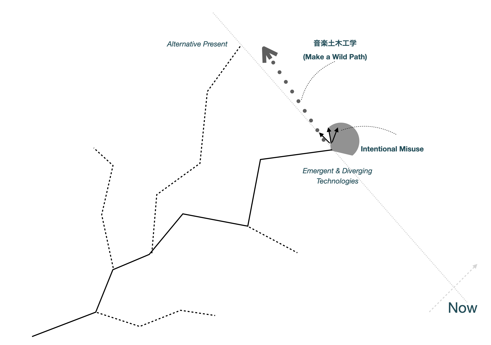
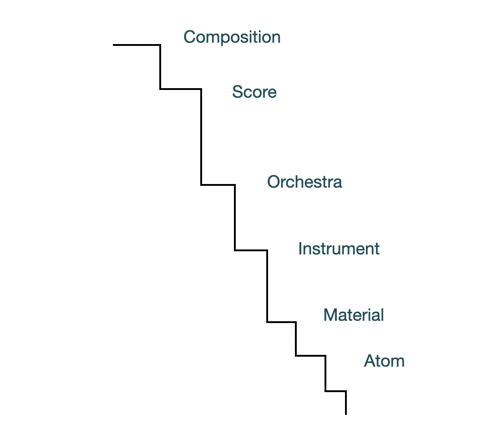

<!-- 第7章 議論-->
# 序言

前章では設計した音楽プログラミング言語mimiumの仕様と特徴を例示してきた。

mimiumはラムダ計算ベースの汎用プログラミング言語の設計、実装の上に最低限の音楽向けの機能ー論理時間ベースのスケジューラと`delay`や`self`を用いた時間方向の参照による表現をという大きく分けて2つの機能を足すことで、汎用プログラミング言語の自己拡張性を失うことなくブラックボックス的構造によるアクセス不可能性を可能な限り排すことを目指した。

本章では前半、言語の実装において未だ不十分である機能の分析を通し、その過程をプログラミング言語に限らない、音楽におけるコンピューターの使い方全般の議論に一般化することを試みる。後半は、2〜5章でそれぞれ大きな文脈から焦点を絞る形で行ってきた音楽プログラミング言語研究の文脈の構築を、今度は**逆順で**、焦点を広げていく形でそれぞれの章ごとの話題についてmimium設計、実装を通じた貢献を改めて振り返る。つまり音楽プログラミング言語設計における実装の方針と特性のトレードオフという選択の中でのmimiumの設計の選択（あるいは、非選択）、歴史的な観点でみた音楽インフラストラクチャとしてのプログラミング言語設計の位置付け、デザイン実践を通じた研究(RtD)としてのプログラミング言語設計の学術的貢献、2020年代においてコンピューターを積極的に使う音楽家の実践のあり方、という順番になる。

# PLfMとは何か？

ここまでの視点で一度改めて本研究の提出する貢献のひとつ、音楽プログラミング言語の存在論についての議論を具体的な実装を踏まえて固めよう。

音楽プログラミング言語とは本質的にはマッカートニーの言ったように、**音楽のための最低限の抽象化機構を備えた人工言語**である。

プログラミング言語とは今日においては、ハードウェアの違いに依存しない抽象的な計算モデルを、（必ずしもテキストに限らない）人間が知覚、認識、記述可能な形で記述、操作できるようにしたものである。ただし、ハードウェアを意識する必要のない汎用高級言語の多くは、メモリ確保/開放の隠蔽をガベージコレクションという、実行タイミングに不確定性を生じさせる機能で実現しているので、汎用言語のライブラリとして、信号処理を含むリアルタイムな動作が可能なDSLを構築することは難しい。

そして、言語実装者にとっての最低限の抽象化の線引きによってその言語の実行環境は、大きければUnit Generatorのインタプリタモデルのようになるし、小さければFaustのような厳格な形式的意味論を備える言語体系になる。

最低限のラインを大きくすると、それは基本的に、十二音の音階や、モジュラーシンセサイザーのメタファーなど、ある音楽様式が言語自体に埋め込まれてしまい、プログラマーの思考をその様式に固定してしまうだけでなく、基本的にプログラミング言語としての抽象化能力は高くないものが多いので、基本から外れた試みを行うためにその言語上で高度なライブラリを作ることも難しいといった問題が生じてしまう。

一方で、最低限のラインを下げれば下げるほど、その言語自体の設計や実装に必要な知識は音楽ではなくコンピューターに関する知識そのものになっていく。

さらに、比較的現代的なものを含めて汎用プログラミング言語の下敷きになっている理論は基本的に、可能な限り速く計算できることが是とされる、時間を考慮しない計算モデルを基にしている。現状、時間の概念が関係してくる抽象計算モデルの議論の種別としては次のような4種類に分類される。1つ目は、例えば線形時相論理、計算木論理などの "時間Aまでに処理が間に合っていればBの処理を、間に合わなければCを"、といった、実時間に伴うタイムアウト処理などの用途を想定したリアルタイムコンピューティングの議論。2つ目は、Communicating Sequential Processes（CSP）や$\pi$計算のような、並行システムをラムダ計算と同じように、形式的に抽象化する方法についての議論。3つ目は、Functional-Reactive Programming（FRP）のような、時間に伴って変化するデータ全般を抽象的に表すことを目的とした関数型プログラミングの議論。4つ目は、FaustやW計算（後述）のような、音声信号処理で使われることを想定した、実時間ではなく等間隔な時間で発生する計算の順序を保証し、かつ、漸化式的に、時間方向に遡って計算結果を利用する計算モデルである。

リアルタイムコンピューティングと並行システムの抽象化は音楽以外の分野が議論の中心である。FRPは元々アニメーションなどの表現に使われることを想定としているが、信号処理の理論との接続は未だ積極的に行われてはいない（数少ない例としては[@Reach2013]や[@Gaster2018]）。

これら4種類の時間に関わる計算モデルを統合するような研究は未だ行われていない。その上、仮にもし時間を含めた計算モデルがあったとしても、現代で使われているコンピューターの利用方法自体、特にOSのスケジューラーなどに実行タイミングの不確定性が常に存在している。

そのため、なるべく可能な表現範囲の広いPLfMを設計しようと思うと、まずライブラリではなく言語の設計そのものを行う必要がある。一方で、未だ確たるものが存在しない時間を考慮した抽象計算モデルを考慮に入れた意味論の設計をし、その上で、ハードウェアやOSと言った、現状存在しているインフラストラクチャ上で動くランタイムプログラムの工夫などで、実行モデルとインフラストラクチャの不一致をつなぎ合わせる、という、暫定解を探し続ける必要がある。

mimiumでは特に`@`演算子の実行を保証するのは基本的にはランタイムのスケジューラーの実装が正しいことを信用するしかなく、厳密な意味論を定義することは現状のシステムではそもそも難しい。しかし、mimiumの`self`のような、ChronicやFaustと異なり、ラムダ計算ベースの記述を基本にしながらも内部状態を伴う関数の形式化に関しては本研究と並列して研究がなされている。

## より形式的な定義のための関連研究

現在のところ、mimiumの統語論の定義に関しては付録で示すように形式的な定義を行えてはいるが、`self`のような状態付き関数の意味論は実装によって示されているのみである。

この参考となる研究がmimiumを発表したACM SIGPLAN FARM(Functional Art, Research, Modeling)というワークショップで同じセッションで発表されたW計算（W-calculus、ラムダ計算と同じような名付け）である[@Arias2021]。W計算はFaustに強く影響を受けていながらも、Faustのように入出力を持ったブロックのグラフを組み合わせる構造ではなく、ラムダ計算をベースにした信号処理のための計算で、通常のラムダ計算に現れる項に加えて、$feed x.e$といった独自の項が追加されている。この`feed`はその項における1時刻前のサンプルでの計算結果が$x$として項の中で再帰的に利用できるといった意味合いをもち、これはmimiumにおける`self`の概念に直接的に対応する。例えば1サンプルずつ引数`incl`に応じて増加するカウンターの関数[@lst:wcalc]はW計算の中では次のように表せる[^wcalculus]。

[^wcalculus]: W計算はフィルタなどの線形時不変システムの実質的等価性などを形式的に証明することを1つの目的としているため、厳密には式同士の加算と、式と定数の乗算（スケーリング）のみが許されている。しかし基本的な演算の項を追加すれば非線型システムにも対応はできる。

\begin{lstlisting}[float,floatplacement=H,label=lst:wcalc,language=Rust,caption=1サンプルずつ増加するカウンター]
fn counter(incl:float){
    return self+incl
}
\end{lstlisting}

$$
\lambda \: incl.feed \: self.(incl+self)
$$

W計算はディレイのような、過去のサンプルを参照するような意味合いを定義すると、実用的には過去のサンプル全てを保存しなければならず無限のメモリを必要としてしまうという理想的形式化に伴う問題（例えばChronicがその典型である[@Brandt2002,pどこか]）に対しても都度意味論を拡張することで対応できている。また、OCamlで書かれたW計算で記述された信号処理のプログラムを、W計算のインタプリタとともに一度MetaOCaml上で評価することで、入力プログラムに特化したインタプリタプログラムを生成し、コンパイラの最適化をさらに組み合わせることでリアルタイムでの計算も実現できるようになっている、Multi-rate信号処理への拡張も既に方針が示されているなど、実用を意識した上での理論構築がなされている。

mimiumも根本的な意味論の定義をW計算の形式を借りることによって可能になるだろうと考えられる。もっとも、W計算においても時間方向に離散的な処理の意味論は含まれておらず、現状のランタイムとの通信という実装に依存する定義方法に対する解は今後別に検討する必要がある。

# プログラミング言語だけで十分なのか

PLfMのための最低限の抽象計算モデルの不在を理解した上で、それでも可能な限り最低限を目指したのがmimiumの設計方針である。この最低限の不在は研究領域として大きな課題であるのは間違いない。しかし、なるべく汎用性の高い言語が仮に作れたとして、それだけで、MIDIやUGenのような埋め込まれた音楽様式と異なる音楽が作られるようなことがあるのだろうか。もっと言えば、1950、1960年代のように、コンピューターを使って音楽を作ることが、コンピューターを理解してプログラムを作るという不可分な行為であったように、音楽家が主体的にコンピューターを扱えるような環境は、汎用性の高い、ブラックボックスのなるべく少ないPLfMを作るだけで実現可能なのだろうか？その、汎用性の高いPLfM自体はいったい誰が作るのだろうか？これが、mimiumを作るなかで最も強く感じた疑問と矛盾だった。

第5章で整理した、音楽プログラミング言語の実装の方針と、それに伴う特性のトレードオフがmimiumではどうなっていたかについて改めて整理しよう。

mimiumの実装方針は、中間表現の粒度を限りなく小さくするために、文字列データの解析から行うExternal DSLとなっていた。コンパイラ・コンパイラであるbisonを用いることで文字列解析の実装そのものはSuperColliderやFaust同様に下げられているが、C++という低レベルプログラミング言語での実装を行っているためその実装の手間（開発コスト）は少なくない。コードの動的変更の難しさや、開発コストの増大はあらかじめ想定されていた通りである。

しかしこの実装のコストは当初予想していたよりもずっと大きく、正弦波を鳴らすための音が出るまでに1年以上の時間を費やすという状況を引き起こし、開発の経験の大半は音に関連したトピックというよりもむしろ汎用プログラミング言語の開発とほとんど変わらないものになっていた。

External DSLとして言語を開発する際のf

また、中間表現の粒度の選択に起因する特性のトレードオフについては、mimiumはラムダ計算をベースにした記法でUnit Generator相当の記述が作れるという意味で可能な表現のGeneralityを優先した設計だった。その代わり、コードの動的変更の難しさや、開発コストの増大はあらかじめ想定されていた通りである。

しかしこの実装のコストは当初予想していたよりもずっと大きく、正弦波を鳴らすための音が出るまでに1年以上の時間を費やすという状況を引き起こし、開発の経験の大半は音に関連したトピックというよりもむしろ汎用プログラミング言語の開発とほとんど変わらないものになっていた。

これは実際mimiumという言語に特有の問題というわけではなく、Generalityを高めようとすれば必然的に発生する問題へと一般化できる。

\begin{figure}[htbp]
  \begin{minipage}{0.5\hsize}
    \begin{center}
        \includegraphics[keepaspectratio, width=1\hsize]{img/Ladder.png}
    \end{center}
    \caption{従来のMulti-Languageパラダイムに基づく言語におけるプログラミングの学習経験の差を "いびつな階段" として概念的に表した図。}
    \label{fig:ladder1}
  \end{minipage}
  \begin{minipage}{0.5\hsize}
    \begin{center}
        \includegraphics[keepaspectratio, width=1\hsize]{img/Ladder2.png}
    \end{center}
    \caption{mimiumのようなブラックボックスを減らし、ライブラリとしての実装の役割を広げた言語における学習経験の差を "突然急になる坂" として概念的に表した図。}
    \label{fig:ladder2}
  \end{minipage}
\end{figure}

音楽プログラミングにおける作業における経験の階段のギャップを減らし、パパートのいう「天井は高く、床は低く」といった目標を追求していくと、これまで（例えばCSoundにおけるScore—Orchestra—Instrument）のように抽象化のレイヤーをその言語上でのライブラリ実装という作業にすることができれば、元々あった言語間のギャップは埋まっていく。

しかし言語自体の汎用性を高めると、肝心のその言語の処理系実装そのものはほとんどテキストデータを読み込んでより抽象的なデータ構造へと変換していくデータ変換器と言った様相を呈してくる。階段のギャップはほとんど均一になったが最後の一段だけが飛び抜けて高い、といった切断を引き起こしてしまう矛盾が根本的に存在する。この現象を説明した図が[@fig:ladder1]と[@fig:ladder2]である。**いびつな階段モデル**：[@fig:ladder1]が各ドメインごとに使う言語を分ける、現状のMulti-Languageパラダイムに基づく言語の使用と開発においてそれぞれの経験の差が発生していることを概念的に表したものだ。なおScore-Orchestra-InstrumentはCSoundで用いられた用語だが、MaterialやAtomはあくまでメタファーとして独自に用いている。言うなればInstrumentというUGenをC言語などでプログラミングする作業がMaterialレベルのプログラム、さらにC言語のコンパイラそのものを作るような作業がAtomレベルのプログラムとでも言えよう。一方、**突然急になる坂モデル**[@fig:ladder2]がmimiumのようなブラックボックスを減らし、ライブラリとしての実装の役割を広げた言語に対応する。シーモア・パパートのいうプログラミング体験における天井と床、つまり高レベルの抽象化と低レイヤーへのアクセス可能性は広がっているし、各言語間に存在した差異もなだらかになっている一方、言語を作ることそのものの難易度はC言語などよりも理論的背景を多く必要とし難易度が高くなってしまう。

つまり、音楽プログラミング言語を作るという作業は最終的に "音楽のためのライブラリを作りやすい汎用言語を作る"と "その言語上でライブラリを作る"という2つの行為へと分裂してしまう。

次に、第4章で検討した歴史的変遷におけるmimiumの位置付けを改めて考察しよう。音楽プログラミング言語は歴史的には、80年代以前はあらゆる種類の音楽制作ソフトウェアの起源としての意味合いが強く、90年代のSuperColliderやMax、Puredataのような、音楽のための最低限の抽象化を施すことで、音楽プログラミング言語を学ぶためにまずそれより低レベルな言語について学ぶような状況を避けつつ、表現は既存の音楽様式に縛られないような自由度を持つといったバランスをとった言語によってその意義が決定づけられたという流れがあったのだった。さらに2000年代は、既存の言語では組み込みのもの（＝UGen）として与えられていたものまでもプログラマブルにできるような、Faustに代表される低レイヤーの拡張、言語の意味論自体に自己反映性の限界があることに対して、既存の汎用言語の表現力を借りることによって突破するような高レイヤーの拡張、オペレーティングシステムに依存してしまう荒いタイミング制御をさらに正確にするような取り組みという3つの方向性が現れてきていた。

この中でmimiumは主に低レイヤーの拡張に重きを置きつつ、既存の言語では信号処理という、時間方向に連続した処理だけでなく、小規模なスケジューラを載せることにより離散的なイベントの実行も射程に入れている。既存の音楽の様式をなるべく言語仕様に埋め込まないようにするべく、汎用言語の設計に最低限の時間制御の言語仕様：関数の時間指定実行と、`self`や`delay`による信号処理における時間方向の参照による表現という2つの機能を載せつつ、かつメモリやスレッドのようなハードウェアを意識する必要はない（特定のハードウェアのアーキテクチャにロックインされない）ような統語論というMcCartneyのいう "音楽のための最低限の抽象化" を現代の状況において可能な範囲で再検討したものだった。

<!-- （この辺ももうちょっと充実させたい） -->

# 音楽土木工学と専門知/アマチュアリズム

<!-- 音楽のためのプログラミング言語を作り始めて以降、作っていることを人に話すと、 -->

# テクノロジーを用いる音楽実践として

最後に、プログラミング言語設計自体を2020年代における1つの音楽的実践としてできるかについて検討しよう。

アマチュアリズム的態度に準じたハッキング/ティンカリング的態度に基づくテクノロジーの誤用はもはや、アクセス不可能なブラックボックスにより無効化され、コンピューターという象徴機械を介して音楽文化は無意識に画一的な方向に収束する傾向にある。

そうした時代に音楽家が取れる態度はまず、テクノロジーの中身そのものを根本的に理解できるようになっていくよう変わる必要があるし、音楽文化全体においてテクノロジーの理解を促すような教育も必要である。パケットはMaxやPuredataが比較的普及した後でも、それを使うためには教育の要素が不可欠だと主張しているが、この状況は現在になっても変わっていないと言える。

> しかし、コンピュータハードウェアの低廉化によって交わされた約束に、私たちはまだ追いついていない。確かに、いまやすべての道具が入ったコンピュータを400ドル程度で購入でき、アンプとスピーカを追加すればコンピュータ音楽制作の準備が整う。しかしこれは、システムを構築し、フリーの良いソフト見つけてインストールし実行するために必要な知識があることを前提としている。コンピュータを数千ドルに、ソフトウェアを数千ドルにしたいという多くの商業的な関心が、私たちの前に立ちはだかる。
> コンピューティングとコンピュータ音楽の民主化に不可欠な要素は、地域の知識ベースを育成することだ。将来を見据えた音楽教育者は、学生が自分のコンピュータを構築するのを促すために何時間も割いている。自家製コンピュータと自家製コンピュータ音楽ソフトウェアの国際的な文化を、いつか見たいと私は思う。過去に裕福な西側はソフトウェアを開発し、何百万ものCDを作り、買う人には誰にでも販売した。将来的には、他の世界から輸入されたソフトウェアを研究し学習するセンターを見てみたい。
> 知識を育てるコミュニティが、特にLinuxのような非商用OSでは必要である。もしLinuxを使う友人がいなければ、動かすまでには障害があるだろう。しかし、世界の多くで少なくとも村の1人や2人に、コンピュータ音楽の専門知識（マシンの組み立て方法、OSのインストール方法、ソフトウェアの実行方法など）がある未来を想像できる。[@Puckette2002]

{#fig:wildpath width=100%}

さらに、テクノロジーを深いところまで理解した上で取れる態度は2つに分かれる。概念を[@fig:wildpath]として提示した。ひとつはテクノロジーの中身をわかった上で敢えて誤用することで、作られたテクノロジーの価値を転換する[@Tokui2021]という的態度だ。一方でこの態度には、音楽家という人間の外部にテクノロジーを置き、誰かが作ったテクノロジーの変革のタイミングに依存して音楽文化が変化していく、ThebergeのMultiSectorial Innovation的状況を受け入れた上で、即興的に反応して技術の異なる可能性を追求するということにもなる。これは近視眼的な意味でのテクノロジーとそれが生み出す新たな象徴による文化を形成するかもしれないが、Attaliの反復の系から抜け出せるほどの新しい音楽文化を作るには一歩足らない。

そうでないやり方として、ここ数年の人工知能の過熱のような論争中のテクノロジーではなく、論争後、例えばMIDIのようにすでに所与のものと決定づけられてしまい、透明な背景と化してしまったインフラストラクチャのような対象を、長い時間がかかるとしても自らの手で再発明し、あり得るかもしれない今（Alternative Present）を生み出すことが必要だ。そしてそれはデモンストレーションとして議論を巻き起こすところまで完結するのではなく、少しづつでも今作り始めて今使い始めてしまうという、技術の可能性の道の間に存在するフィールドにけもの道を作り出すようなアプローチである。

この態度の1つのインスタンスが、プログラミング言語開発という手段である。

## 音楽プログラミング言語を作るとはどういうことか

RtDとしての実践、音楽実践としてのプログラミング言語制作という話題のまとめとして、本研究の貢献のもうひとつ、音楽プログラミング言語を作るとはどういう行為なのか、についてまとめよう。

音楽プログラミング言語とを作るとはすなわち音楽のための最小限の抽象化機構を実装するということだ。これは大きなブラックボックスを持つUGenパラダイムの言語であれば、オシレーターやフィルターのようなプリミティブUGenを実装する作業も言語設計、実装の一部となる。しかしブラックボックスを小さくした言語ではオシレーターやフィルターの実装はその言語上で行うライブラリの実装作業となる。

<!-- 

{#fig:ladder1 width=90%}

{#fig:ladder2 width=90%} 

-->

# 音楽土木工学という学問領域

<!-- 強いコンピューター音楽 : 作品のユニークネスにコンピューターを使用することが関わってくる
弱いコンピューター音楽 : 頑張ればコンピューターがなくても実現できるけど、コンピューターを使用することで製作/配布/再生/上演が円滑になる

**やや弱いコンピューター音楽: 作品を成立させるのにコンピューターが不可欠だが、コンピューターを使っていることは作品のユニークネスとは特に関係がない**

トフラーのプロシューマー、CGM、End User Programming -->

# 小括